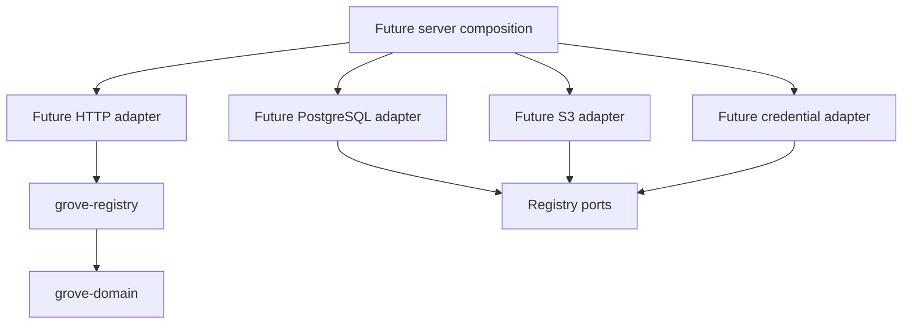

# ADR 001: Feature Contracts Before Adapters

Status: accepted for the initial storage registry slice.

## Boundary

| Owner | Responsibility |
|---|---|
| Domain | Validated identity/configuration, pure deletion and retargeting policy |
| Registry | Registration/replacement sequence, classified errors, no automatic write retry |
| Repository port | Atomic writes, expected revision, reference guard |
| Probe port | Read-only provider access check |
| Protector port | Identity-bound encryption of provider credentials |
| Server | Configuration and concrete dependency composition |

Crates follow independently testable behavior and dependency boundaries. A new
crate is added when an implementation needs a distinct dependency or reusable
contract. HTTP status codes and SQL errors stay outside domain decisions.

## Atomicity

Reference checks and mutation execute in one repository transaction. New
references serialize against replacement/deletion. Domain policy is evaluated
against authoritative state within that transaction.

Revision checking prevents a stale edit from overwriting a concurrent edit.
Revisions remain fresh across deletion and recreation of the same storage ID.
The external probe happens before persistence and does not make the provider and
database one transaction. A generic persistence error is potentially ambiguous;
the caller inspects current state before retrying.

## Verification

| Layer | Evidence |
|---|---|
| Domain | Deterministic values and policy tests |
| Registry | Fake probe/protector/repository and injected failures/interleavings |
| PostgreSQL | Future real transaction, FK and concurrent reference creation tests |
| S3 | Future compatible-provider tests and authorization failure cases |
| Surfaces | Future shared API contract plus CLI/browser tests |

In-memory tests validate the intended repository contract, not database isolation.
Mocks live only under tests and cannot be selected as production adapters.
