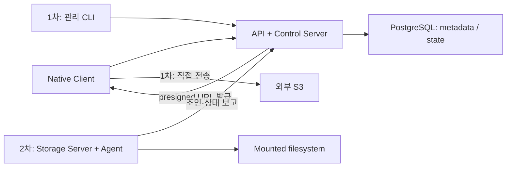

# ADR 007: PostgreSQL 중앙 관리 위에 스토리지를 단계적으로 확장한다

- 상태: Accepted (제품 방향)
- 날짜: 2026-09-08
- 구현 상태: 중앙 메타데이터·서버 로컬 fs·외부 S3·CLI 조회·변경 구현, 운영 이관·Agent는 후속 작업

## 전제와 결정

**객체 메타데이터와 운영 상태는 PostgreSQL을 정본으로 중앙 관리한다.
1차는 외부 S3 전송과 관리 CLI를 정비하고, 2차에 독자 파일 스토리지를 추가한다.**

대상은 홈랩·소규모 온프렘이다. 노드·객체 수와 처리량은 실제 부하 검증으로
운영 범위를 정한다. 중앙 상태를 SQL로 조회하고 트랜잭션으로 전이하는 운영 모델을 택한다.

현재 S3 호환 API는 별도의 중계 경로다. 이 그림은 네이티브 presigned 경로와 확장
경계를 나타내며, 기존 S3 소비자·API의 전환은 별도 결정한다.

## 단계와 완료 기준

아래는 단계별 계획과 검증 기준이다. Accepted는 제품 방향의 채택을 뜻하며,
각 단계의 기능 제공·배포 완료를 의미하지 않는다.

| 단계 | 범위 | 완료 기준 |
|---|---|---|
| 1차 | API·Control Server + PG + 외부 S3 presigned + 관리 CLI | Terraform 없이 등록·조회·키 관리·전송 검증 |
| 1차 운영 이관 | FileGate 등록부의 Terraform 관리 해제 | state·DB·키 복구 준비, 리소스 삭제 없이 기존 소비자 검증 |
| 2차 | 독립 Storage Server·Agent 조인 + 사전 마운트 filesystem | 인증된 조인·상태 보고·객체 I/O·단절 복구 검증 |

외부 S3 지원은 2차에도 유지한다. 현재 서버 로컬 fs adapter와 독립 Agent는 구분한다.
자동 배치·이동·복제는 2차 이후 별도 계약과 검증 범위로 정한다.

## 책임 경계

| 소유자 | 책임 |
|---|---|
| 운영 환경 | 디스크·filesystem·mount 준비, 실행 환경, 백업 |
| PostgreSQL | 논리 이름·물리 위치·객체 상태·작업 진행 기록 |
| API·Control Server | 접근 제어·등록·메타데이터 확정·복구 조율 |
| 외부 S3 | presigned 직접 전송의 객체 바이트 저장 |
| Storage Server·Agent (2차) | 조인·상태 보고, 자기 mounted root의 객체 I/O |
| Reconciler | 중단된 작업 관찰·복구·정리 |
| 클라이언트 | 업무 의미·사용자 권한·논리키 |

Terraform 이관 대상은 FileGate 등록부다. 클라우드 버킷·네트워크의 인프라 관리와
GitOps 배포·운영 비밀 전달은 기존 운영 경계를 유지한다.

## 파생 경계

| 주제 | 현재 근거 | 추가 결정이 필요한 부분 |
|---|---|---|
| 저장소 | [ADR 001](001-multi-storage.md) | Root/Node 모델, mount 식별·상실 처리 |
| 메타데이터 | [ADR 004](004-config-layers.md) | 여러 Root의 배치·작업 기록 |
| 외부 계약 | [S3 spec](../spec/03-s3-surface.md) | 독자 스토리지 S3 계약·기존 소비자 전환 여부 |
| 정합성 | [S3 복구](../spec/03-s3-surface.md#완료와-복구) | 이동·drain·replica의 전이·fencing |
| 운영 | [등록부 운영](../guide/registry-management.md) | 실제 GitOps 이관·배포 이름 전환 |

## 결과

후속 제품명은 **Grove Storage**다. 새 원격 CLI는 독립 바이너리 `gscli`과
`GROVE_*` 연결 설정을 사용한다. 기존 서버 바이너리·환경 변수·배포·API 계약은
FileGate로 유지하며, 서버 이름과 소비자 전환은 별도 릴리스에서 정한다.

기존 ADR 000–006은 현재 두 API·두 backend의 배경 결정이다. 새 방향은 이 ADR에서
읽고, 구현된 동작은 spec에서 확인한다. 자동 배치·이동·복제·캐시는 별도 구현 범위다.
