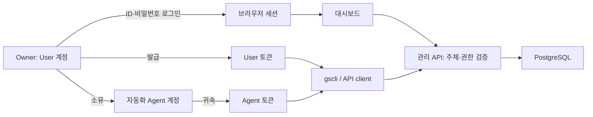

# ADR 008: 로컬 관리자 계정이 User·Agent 토큰을 관리한다

- 상태: Accepted (제품 방향), 구현 예정
- 날짜: 2026-09-24
- 선행 전제: [ADR 007](007-grove-storage-foundation.md)
- 현행 구현·전환 계획: [관리자 인증](../spec/05-admin-auth.md)

## 전제

| 요구 | 결정 |
|---|---|
| 독립형 설치, 사람 관리자 한 명 | 로컬 ID·비밀번호로 최초 Owner 계정에 로그인 |
| 대시보드에서 자격증명 관리 | Owner가 User·Agent 토큰을 발급·조회·폐기 |
| CLI·자동화의 행위 구분 | 토큰을 사용하는 프로그램과 인증 주체를 분리 |
| 중앙 상태 관리 | 계정·토큰·세션·감사 기록의 정본은 PostgreSQL |

## 인증 주체

| 경계 | 계약 |
|---|---|
| User | 설치의 Owner; 자기 토큰·Agent·등록부 관리 |
| Agent | Owner가 만든 자동화 주체; 위임받은 등록부 작업 수행 |
| 토큰 | User 또는 Agent에 귀속된 credential; 원문은 발급 시 한 번 제공 |
| 브라우저 세션 | 비밀번호 로그인으로 발급하고 User에 직접 귀속 |
| CLI | User·Agent 토큰을 사용하는 API client |
| 서비스 자격증명 | 기존 Native client key·S3 credential의 파일 접근 계약 |
| Provider secret | 서버가 외부 S3에 접근하는 자격증명 |
| Storage Node Agent | 2차의 조인·상태 보고 주체; 별도 노드 인증 계약 |

## 참고와 적용

NoteGate `c7df9580`의 `docs/adr/0002-user-managed-agents-and-space-connections.md`,
`backend/crates/model/src/{account,agent,api_key}.rs`,
`frontend/web/src/features/settings/KeyManager.tsx`를 확인했다.

| NoteGate | Grove 적용 |
|---|---|
| User가 Agent를 소유하고 키 lifecycle을 관리 | 계정 소유 관계·원문 한 번 표시·만료·폐기 UI 참고 |
| AuthGate OAuth/OIDC 사람 로그인 | 로컬 ID·비밀번호 로그인 |
| 연결된 Space의 read/write 위임 | 등록부 자동화 권한을 별도로 정의 |

## 결과

최초 계정 설정·분실 복구는 설치 관리자가 로컬에서 수행한다. 이후 토큰 관리는
대시보드와 같은 관리 API를 사용하는 CLI에서 수행한다. 감사 기록은 행위 주체와
사용한 credential을 함께 기록한다. 세부 권한·만료·전환 계약은 spec에서 확정한다.
