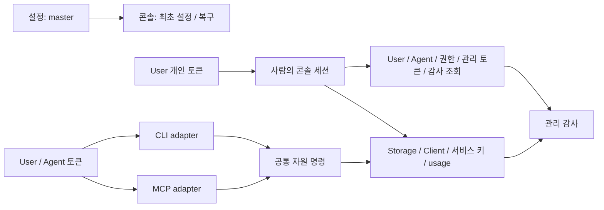

# ADR 009: 신원 관리는 콘솔로, 자원 관리는 공통 명령으로 제공한다

- 상태: Accepted (제품 방향), 순수 권한·명령·신원 DB·관리 서비스 구현·HTTP 미연결
- 날짜: 2026-09-24
- 선행: [ADR 007](007-grove-storage-foundation.md)
- 대체: [ADR 008](008-local-owner-and-agent-credentials.md)
- 계약·DB·검증: [spec 08](../spec/08-management-plane.md)

## 전제

| 전제 | 결정 |
|---|---|
| 하나의 Grove 인프라를 통합 관리 | Storage·Client는 설치의 자원; 사용자별 테넌트로 재정의하지 않는다 |
| 비밀번호 계정 운영을 줄인다 | 설정의 마스터 토큰으로 최초 Admin 생성, 이후 개인 토큰 로그인 |
| 실제 작업 주체를 구분한다 | DB의 User·Agent와 자격증명을 분리한다 |
| 사람만 신원·권한을 관리한다 | 콘솔의 User 세션에서 역할을 검사한다 |
| CLI·MCP가 같은 운영 기능을 제공한다 | 등록부 작업의 명령·검증·오류·권한을 공유한다 |
| 관리 행위의 책임을 추적한다 | 변경 감사·호출 기록·보안 이벤트를 구분한다 |

## 경계

| 구분 | 역할 |
|---|---|
| 마스터 | 최초 설정·관리 접근 복구; 일반 자원 API와 별도 권한 |
| User | 사람; viewer / operator / admin |
| Agent | User가 소유한 자동화 주체; viewer / operator, 소유자 권한 이내 |
| 관리 토큰 | User 또는 Agent를 인증; CLI/MCP 사용 여부와 독립 |
| Client·서비스 키 | 기존 서비스 호출·파일 데이터 경계 |
| Storage | 외부 S3 또는 현재 서버 fs 자원; 자동 배치는 후속 |
| Storage Node Agent | 향후 노드 조인·I/O 프로세스; 관리 Agent와 별도 인증 |

## 인증과 배포

외부 OAuth2 Proxy는 콘솔 앞단 접근을 보호한다. Grove는 자체 토큰·세션으로 주체를
확정한다. 기계용 API는 대화형 로그인과 분리하고 Bearer/SigV4를 원래 용도로 전달한다.
콘솔 전용 API는 유효한 사람 세션·역할·CSRF로 보호한다. Admin Bearer도 이를 대신하지 않는다.

초기에는 관리자 한 명을 생성하고 필요할 때 콘솔에서 User를 추가한다. 모든 User는
같은 인프라를 관리한다. 개인 토큰 원문은 발급 시 한 번 제공하고 DB에는 해시를 저장한다.
향후 OIDC는 기존 User에 별도 로그인 수단을 연결하며 자원·Agent·이력 ID를 유지한다.

## 참고와 차이

NoteGate `770880e3`의 `docs/spec/command-api.md`, `docs/spec/event-logging.md`,
`backend/crates/model/src/identity/caller.rs`와 identity schema를 참고했다.

| NoteGate | Grove |
|---|---|
| Account + User/Agent | 같은 신원 구분; 설치 단위 역할 적용 |
| 사람 OIDC, Agent 전용 API key | 사람 개인 토큰·세션, Agent 토큰; 마스터 설정·복구 |
| CLI/MCP 공통 명령 | Storage·Client 관리만 공통 명령으로 제공 |
| User 소유 Space·Agent 연결 | Storage·Client의 기존 데이터 계약 유지 |
| 변경 이력과 실행 관찰 분리 | 관리 영역에 적용; 기존 파일 작업 로그는 별도 |

## 결과

비밀번호 UI·공개 가입·사용자별 Storage 소유 모델은 이번 설계 범위 밖이다.
신원 관리는 전송 방식과 무관한 역할 검사만으로 허용하지 않고, 콘솔 세션 경계도 검사한다.
기존 인증·CLI의 전환은 별도 단계로 검증하며 이 ADR은 배포 완료를 의미하지 않는다.
