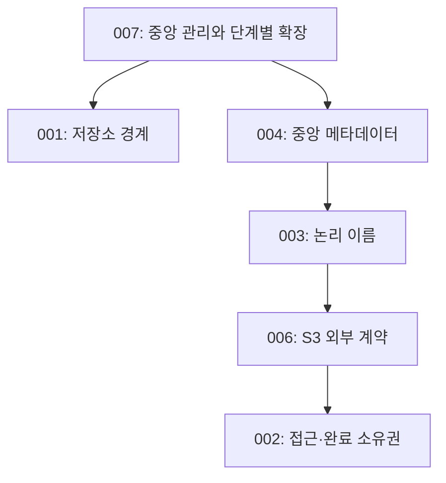

# Architecture Decision Records

ADR은 한 가지 구조적 결정과 이유를 기록한다. 세부 요청·상태 전이는 spec,
실행 명령은 기술·운영, 코드 책임은 소스 구조에서 관리한다.

## 읽는 순서

007은 새 제품 방향이다. 000–006은 현재 FileGate의 네이티브·S3 표면과
멀티 backend를 설명한다. 구현 전환 상태는 [문서 목차](../README.md#현재와-방향)에 둔다.

| ADR | 결정 |
|---|---|
| [007](007-grove-storage-foundation.md) | PostgreSQL 중앙 관리 위에 외부 S3·독자 스토리지를 단계적으로 제공한다 |
| [000](000-identity.md) | 업무 의미와 파일 물리 관리를 분리한다 |
| [001](001-multi-storage.md) | 저장소 접근 계약과 파일 위치를 등록부에 기록한다 |
| [004](004-config-layers.md) | client·storage·자격증명의 정본을 DB에 둔다 |
| [003](003-url-ownership.md) | 서비스는 안정 이름을, 접근 URL은 발급 주체가 소유한다 |
| [006](006-s3-compat-surface.md) | S3 요청을 공유 파일 원장으로 처리한다 |
| [002](002-lease-model.md) | 접근과 완료 복구를 lease 원장으로 추적한다 |
| [005](005-presigned-byte-plane.md) | 네이티브 전송은 서명 URL을 발급한다 |

## 용어

| 용어 | 뜻 |
|---|---|
| client | 서비스를 식별하는 등록 단위; 현재 S3 bucket 이름 |
| storage | fs 경로 또는 외부 S3 접근 계약 |
| file / location | 파일 정체성 / 현재 물리 위치 |
| logical key | `(client, key) → file` 매핑의 서비스 소유 이름 |
| lease | 접근의 목적·만료·진행 기록 |
| registry | storage·client·자격증명의 PostgreSQL 정본 |
| capacity / usage | 등록 용량 기준선 / 조회 시점 점유 관찰 |
| detach / purge | 논리 삭제 결정 / 물리 삭제 집행 |
| reconciler | 요청 밖에서 실물과 기록을 관찰·복구·정리하는 워커 |
| Root / Node / Pool | 2차 이후 설계할 mount / 실행 머신 / 논리 저장소 집합; 현재 모델은 storage |
