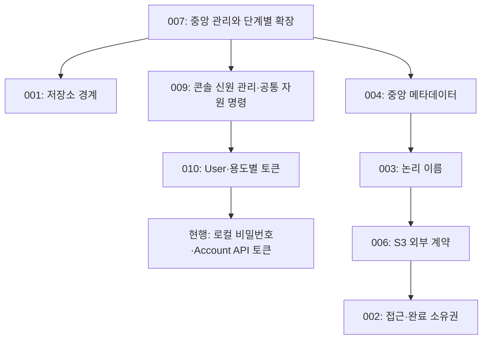

# Architecture Decision Records

ADR은 한 가지 구조적 결정과 이유를 기록한다. 세부 요청·상태 전이는 spec,
실행 명령은 기술·운영, 코드 책임은 소스 구조에서 관리한다.

## 읽는 순서

```mermaid
flowchart TD
    G["007: 중앙 관리와 단계별 확장"] --> S["001: 저장소 경계"]
    G --> I["009: 콘솔 신원 관리·공통 자원 명령"]
    I --> U["010: User·용도별 토큰"]
    U --> L["현행: 로컬 비밀번호·Account API 토큰"]
    G --> M["004: 중앙 메타데이터"]
    M --> N["003: 논리 이름"]
    N --> A["006: S3 외부 계약"]
    A --> R["002: 접근·완료 소유권"]
```

007은 제품 범위, 009·010은 관리 책임·공통 명령·단일 계정 결정의 기록이다.
009·010의 Master·토큰 로그인과 011의 Root 인증은
[로컬 관리 인증](../spec/11-local-management-auth.md)으로 대체되었다.
008은 구현 전에 009로 대체된 기록이다.
000–006은 FileGate에서 이어지는 네이티브·S3 표면을 설명한다.
저장소 범위는 007의 S3-only 전환을 반영하며 독립 filesystem Node는 후속 설계다.
구현 전환 상태는 [문서 목차](../README.md#현재와-방향)에 둔다.

| ADR | 결정 | 현재 상태 |
|---|---|---|
| [007](007-grove-storage-foundation.md) | PostgreSQL 중앙 관리와 단계별 저장소 확장 | S3-only 구현, 독립 filesystem은 후속 설계 |
| [009](009-management-identity-and-command-boundary.md) | 콘솔 신원 관리와 공통 자원 명령 분리 | 경계 유지, 신원·인증 모델 대체 |
| [010](010-unified-users-and-named-tokens.md) | 단일 계정·용도별 토큰·credential_id 추적 | 경계 유지, 로그인·복구 계약 대체 |
| [011](011-root-and-accounts.md) | 설정 소유 Root와 DB 계정 | 로컬 관리 인증으로 대체 |
| [008](008-local-owner-and-agent-credentials.md) | 비밀번호·단일 Owner 안 | 구현 전에 009로 대체 |
| [000](000-identity.md) | 업무 의미와 파일 물리 관리 분리 | 유지 |
| [001](001-multi-storage.md) | 저장소 접근 계약·파일 위치 등록 | 저장소 범위는 007 반영 |
| [004](004-config-layers.md) | client·storage·자격증명의 DB 정본 | 유지 |
| [003](003-url-ownership.md) | 서비스의 안정 이름·발급 주체의 접근 URL | 유지 |
| [006](006-s3-compat-surface.md) | S3 요청의 공유 파일 원장 | 유지 |
| [002](002-lease-model.md) | lease 기반 접근·완료 복구 | 유지 |
| [005](005-presigned-byte-plane.md) | 네이티브 서명 URL 전송 | 유지 |

## 용어

| 용어 | 뜻 |
|---|---|
| client | 서비스를 식별하는 등록 단위; 현재 S3 bucket 이름 |
| storage | 외부 S3 접근 계약 |
| file / location | 파일 정체성 / 현재 물리 위치 |
| logical key | `(client, key) → file` 매핑의 서비스 소유 이름 |
| lease | 접근의 목적·만료·진행 기록 |
| registry | storage·client·자격증명의 PostgreSQL 정본 |
| capacity / usage | 등록 용량 기준선 / 조회 시점 점유 관찰 |
| detach / purge | 논리 삭제 결정 / 물리 삭제 집행 |
| reconciler | 요청 밖에서 실물과 기록을 관찰·복구·정리하는 워커 |
| Root / Node / Pool | 2차 이후 설계할 mount / 실행 머신 / 논리 저장소 집합; 현재 모델은 storage |
