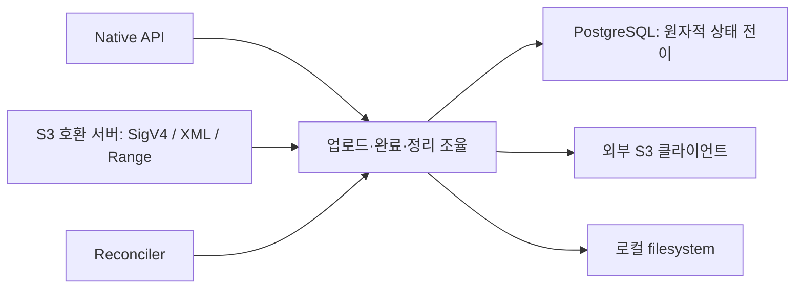

# FileGate 이관과 책임 분리 분석

상태: 코드 이관 완료 / 책임 분리 제안 / 운영 전환 전.

## 기준선

| 구분 | 기준 |
|---|---|
| 원본 | `cagojeiger/filegate`, `af685807e5561885616e00918f0207e25188fb3a` (0.4.1) |
| 기존 Grove 실험 | `2f2f468`, Git 이력에 보존 |
| 원본 코드 이관 | `0a9c185`, 원본 커밋과 tracked tree 동일 |
| 미커밋 작업 이관 | `ff86fa1`, 관리자 인증·0007 migration·콘솔 원본·테스트·로고 |
| 원본 전체 이력 | `archive/filegate-baseline` 브랜치 |
| 현재 작업 | `codex/import-filegate` 브랜치 |
| 제외 항목 | `.env`, `.DS_Store`, 빌드 캐시, node_modules, 검증용 스크린샷·HTML wrapper |
| 운영 | 원본 checkout·운영 DB·객체·배포 유지 |

기준선 이관과 미배포 작업을 별도 커밋으로 구분한다. `0007_admin_auth.sql`은
기존 미커밋 작업에서 가져온 스키마다. 이번 책임 분석에서 새 스키마를 설계한 것은 아니다.
콘솔은 메모리 기반 미리보기이며 실제 관리자 API 연결은 후속 작업이다.

## 이관 기준선 구조

```text
backend/crates/
  api/     HTTP + 인증 + 유스케이스 조율 + 복구 워커
  core/    환경 설정 + 암호화 + 해시 + multipart 규칙
  db/      SQL + 트랜잭션 + 파일/lease/session 상태 전이
  infra/   외부 S3 클라이언트 + 서버 로컬 filesystem
  cli/     관리자 HTTP 클라이언트 + 출력 + 자기 업데이트
output/
  filegate-console-management.html   미연결 콘솔
  console-tests/                    미리보기 브라우저 테스트
```



**S3 호환 서버와 외부 S3 클라이언트는 다른 책임이다.** 논리키·파일 UUID·물리
object key의 매핑과 lease·용량·복구 정책은 자체 스토리지 로직이다.

## 수정 이력이 보여주는 경계

아래는 커밋 제목뿐 아니라 실제 diff와 현재 구현·회귀 테스트를 확인한 결과다.
이미 수정된 결함은 현재 버그와 구분한다.

| 이력 | 이전 → 수정 이후 | 분리 기준 | 유지할 검증 |
|---|---|---|---|
| `57b6095` | multipart 계산 중복 → core의 geometry·ETag 공유 | 순수 업로드 규칙 | part 경계·크기·복합 ETag |
| `0223296` | 세션의 논리키·완료 의도 부족 → `s3_uploads`에 먼저 저장 | 업로드 세션 수명주기 | 다른 key로 complete, overwrite 실패, complete/abort 경합 |
| `0223296` | 생성 중 실패 정리 불충분 → vendor abort 확인 후 예약 회수 | 외부 I/O와 DB 사이의 실패 보상 | abort 실패·DB 기록 실패·재시도 |
| `15d1f43` | native complete와 part/reclaim 경합 → durable 완료 소유권 | native와 S3가 공유하는 완료 정책 | part/complete 단일 승자 |
| `15d1f43` | terminal lease GC가 복구 자료 제거 가능 → 완료 소유 파일 보존 | cleanup과 GC의 같은 수명주기 경계 | `terminal_lease_gc_preserves_cleanup_recovery_material` |
| `9f95406` | 락 대기 전 JOIN 조건에 의존 → 락 획득 후 새 snapshot에서 소유권 재조회 | PG adapter의 원자적 전이 | `support/lock_wait.rs` 기반 결정적 경합 테스트 |
| `a07f0b8` | 예약 경로가 S3 fallback에 유입 → 인증·CORS 앞에서 차단 | 프로토콜 조합 경계 | 전체 router 테스트 |
| `b6bd6fa` | S3 registry 한 파일 → credentials/keys/uploads 모듈 | 자격증명·이름 매핑·세션 구분 | key 교체와 이전 파일 detach의 동일 트랜잭션 |
| `b6c87a7` | reconciler 내 S3 완료 복구 → 별도 모듈 | 복구 판단과 워커 스케줄 분리 후보 | job 순서·lock 범위·재시도 의미 |

파일 분리는 이미 일부 진행됐다. 남은 문제는 함수가 `AppState`·`PgPool`·실제
S3 클라이언트에 직접 묶여 있다는 점이다. 크레이트 수보다 실패 시나리오의
독립 재현 가능성을 기준으로 분리한다.

## 우선순위

| 순서 | 후보 책임 / 제안 crate | 이관 시 코드 | 완료 기준 |
|---|---|---|---|
| 1 | 순수 객체 규칙 / `grove-object-policy` | `core/multipart.rs`, `api/validation.rs`, 완료 관찰 판단 | DB·Tokio·AWS·환경 변수 없이 값 기반 테스트 |
| 2 | 업로드·완료·복구 유스케이스 / `grove-object-service` | `v1/files.rs`, `v1/multipart.rs`, `s3/multipart.rs`, `reconciler/*` | 저장소 실패·응답 유실·재시작을 fake port로 재현 |
| 3 | S3 서버 계약 / `grove-s3-protocol` | `s3/auth.rs`, `xml.rs`, `object_response.rs` | SigV4·XML·Range·오류 계약, 조합 라우터 테스트 유지 |
| 4 | 등록부 유스케이스 / `grove-registry` | `admin/storages.rs`, `admin/clients.rs`, `db/registry.rs` | 등록 검증·키 회전·참조 보호를 HTTP 밖에서 테스트 |
| 5 | 관리자 인증 유스케이스 / `grove-admin-auth` | `api/admin_auth`, `db/admin_auth.rs` | 발급·폐기·복구·세션 만료 정책, HTTP의 cookie/CSRF는 adapter |

1단계의 `grove-object-policy`는 업로드 선언·파트 계산·ETag에 한해 추출했다.
완료 관찰 판단도 같은 crate로 추출했다. 나머지 표는 제안이다. 각 단계에서
실제 재사용·테스트 경계가 확인되는 책임만 독립 crate로 만든다.

```text
api / reconciler / CLI
          |
          v
  service + policy + ports
          ^
          |
  PG adapter / S3 backend / filesystem adapter
```

PG·S3·filesystem 구현은 ports를 구현한다. 실행 바이너리가 구현체를 조립한다.
처음에는 기존 `db`·`infra`를 유지하고, 필요해질 때 `grove-pg`·`grove-s3-backend`·
`grove-fs-backend`로 나눈다. crypto는 기존 파생 키 계약을 유지하며 config와
같은 순수 domain으로 취급하지 않는다. CLI는 이미 HTTP 경계가 있어 우선순위가 낮다.

## 원자성 유지

| 하나의 작업으로 유지할 경계 | 이유 |
|---|---|
| 완료 선점 + part 차단 | complete와 part의 단일 승자 |
| file lock + 소유권 재조회 + 전이 | 락 대기 중 바뀐 상태 반영 |
| 논리키 publish + 기존 file detach + 용량/lease 반영 | 성공한 overwrite의 일관된 노출 |
| cleanup 성공 확인 + 복구 자료 해제 | vendor 장애 뒤 재시도 가능 |

Port는 `get`/`set` 여러 개보다 `claim_completion`·`finalize_upload` 같은
원자적 작업 단위로 제공한다. PG 구현이 SQL·락 순서·제약을 소유한다.
Fake는 흐름 테스트에 사용하고, 동시성 보장은 실제 PG 테스트로 검증한다.

native와 S3 완료 흐름은 닮았지만 S3에는 논리키 publish와 single upload 복구가
추가된다. 공통 관찰 판단을 먼저 추출하고 각각의 확정 작업은 구분한다.
현재 generic reclaim은 전이 후 물리 삭제 실패를 orphan 로그로 남기는 정책이며,
S3 abort/native completion cleanup의 재시도 정책과 다르다. 추출 시 이 차이를 보존한다.

## 별도 동작 개선 후보

| 코드에서 확인한 위험 | 영향 | 다음 검증 |
|---|---|---|
| 사용 중 storage의 물리 주소 전체 치환 | 기존 location이 다른 실물을 가리킬 수 있음 | 후속 수정: location 존재 시 주소 변경 409, 파일 예약과 storage 락 공유 |
| generic reclaim은 DB 전이 후 물리 삭제 실패를 로그로 남김 | orphan 정리가 지속 재시도되지 않을 수 있음 | 장애 주입으로 현재 계약 재현 후 durable cleanup 필요성 결정 |

두 항목은 이번 기계적 이관에서 변경하지 않았다. 책임 추출과 동작 변경은 별도
커밋·검증으로 진행한다. 크레이트 분리만으로 해결된 것으로 취급하지 않는다.

### 후속 동작 변경: 저장소 주소 보호

사용 중 저장소의 주소 교체를 거부하도록 DB·API 계약을 변경한다. 키 회전·용량 변경은
유지하고 새 migration은 추가하지 않는다. Native와 S3의 공통 `create_in_tx`가 storage
공유 락을 잡아 갱신과 직렬화한다. 갱신은 배타 락 뒤 새 snapshot으로 location을 조회한다.

검증은 `db/tests/storage_update.rs`, `storage_update_races.rs`로 분리한다.
`scripts/e2e-cli.py`는 실제 서버에서 0바이트 pending 파일의 주소 변경 409와 CLI 실패를
확인한다. 기존 일반 만료 회수의 orphan 문제는 이 수정과 별도다.

검증: workspace 274개 통과, release artifact 1개 ignored. fmt·clippy 통과.
격리 실서버의 기존 CLI lifecycle 및 사용 중 주소 변경 409·CLI 거부 E2E 통과.

### 일반 만료 회수: 수정 전 재현

`db/tests/reclaim_cleanup_gap.rs`는 현재 한계를 기록하는 characterization test다.
정상적인 복구 계약을 선언하는 테스트가 아니며, durable retry 구현 때 기대값을
복구 정보 보존·재시도 성공으로 교체한다.

| 단계 | 격리 PostgreSQL에서 확인한 결과 |
|---|---|
| Native pending 생성·lease 만료 | 회수 후보 1개 |
| 실제 `finalize_reclaim` 실행 | reclaimed, location 0개 |
| 물리 삭제 실패 주입 | fake 객체는 남음 |
| 다음 회수·purge 후보 조회 | 모두 0개 |
| 장부 사용량 조회 | reserved/active/purge_pending 모두 0 |
| 같은 storage의 bucket 변경 | 남은 location이 없어 허용 |

실제 SQL·스캔 함수와 fake 물리 삭제 실패를 사용한 구성요소 재현이다. 전체 worker나
외부 S3 네트워크 장애·운영 사고의 재현은 아니다. 기존 reconciler 주석이 명시한
orphan 허용 정책을 확인한 것으로, 이번 리팩토링의 신규 회귀로 분류하지 않는다.
재현 테스트 1개와 해당 target clippy·fmt를 검증했다. 실행 코드 변경은 없다.

후속 수정은 pending 소유권을 먼저 종료하면서 정리 위치를 내구적으로 보존하고,
물리 정리 성공 뒤에만 복구 자료를 해제하는 방향이다. 단순히 삭제 순서를 뒤집으면
늦은 commit과 경합할 수 있으므로 claim·재시도·GC·사용량·주소 보호를 함께 검증한다.

## 테스트 정리

| 범위 | 현재 | 보완 |
|---|---|---|
| PG 수명주기·경합 | native/S3 완료·abort·GC·lock wait 테스트 | 그대로 유지하고 adapter 계약으로 연결 |
| 순수 규칙 | `object-policy/tests`로 추출 완료 | geometry·ETag·validation 독립 테스트 |
| 요청↔vendor↔DB 실패 조합 | 핸들러·워커에 결합 | 단계별 실패 주입과 재시작 테스트 |
| S3 프로토콜 | SigV4·Range·라우팅 단위 테스트, capture 스크립트 | 실제 SDK+backend 왕복 검증 |
| 관리자 인증 | DB·HTTP 정책 테스트 | 실서버 로그인·복구·폐기 시나리오 자동화 |
| 콘솔 | 메모리 기반 Playwright 13개 | 실제 API 연결 뒤 권한·등록·삭제 E2E |

`db/tests/s3_multipart_*`는 이미 시나리오별로 분리되어 있다. 큰 테스트를 다시
하나로 합치지 않고, native 완료 테스트도 claim·recovery·GC별 파일로 나눈다.
`s3_registry/uploads.rs`(970줄), `api/s3/multipart.rs`(750줄)는 우선 탐색 대상이지만
행 수 자체를 crate 분리 근거로 삼지는 않는다.

## 후속 순서

1. 완료: 이관 기준선 검증 (workspace·PG·CLI·콘솔 테스트).
2. 구현: 순수 업로드 규칙 추출 (API 응답·schema·동작 유지, core multipart 경로 재노출).
3. 업로드/완료/복구 유스케이스 추출: 실패 주입 테스트부터 보강.
4. 등록부 변경 안전성 보완: 정책 확정·회귀 테스트·별도 동작 변경.
5. 관리자 API에 콘솔 연결: CLI 기능 대응표와 실제 E2E.
6. Grove 릴리스 전환: 패키지명·업데이트 URL·배포·데이터 이관 리허설.

## 릴리스·데이터 경계

| 항목 | 이번 결정 |
|---|---|
| 버전·서버 이름 | FileGate 0.4.1 기준선 유지 |
| 릴리스 workflow | `cagojeiger/filegate`만 자동 발행; Grove 채널은 후속 전환 |
| `gscli update`·installer | 기존 FileGate 채널 유지, Grove 출시 전 변경·검증 |
| Git 이력 | 기존 Grove와 FileGate history 각각 보존; 기존 release tag는 원격 발행과 구분 |
| DB·객체 이관 | 이번 작업은 소스 이관, 운영 데이터 이동은 별도 |
| 보존 계약 | UUID·client/storage ID·logical key·물리 object key·진행 중 lease/session |
| 암호 계약 | root key·key ID·HKDF label·AAD 유지 |

Git 이력에 기록된 release 이름은 새 저장소에서 바이너리를 발행했다는 의미가 아니다.

## 이관 검증 결과

| 실행 | 결과 |
|---|---|
| 기준선 tree 비교 | `git diff 0a9c185 archive/filegate-baseline -- .` 차이 없음 |
| `cargo test --workspace --locked` | 239 통과, native release artifact 테스트 1개 ignored; 격리 PostgreSQL 17 사용 |
| `cargo fmt --all --check` | 통과 |
| `cargo clippy --workspace --all-targets --locked -- -D warnings` | 통과 |
| `python3 deploy/ci/check-version.py` | 0.4.1 일치 |
| `python3 -B -m unittest discover -s deploy/tests -v` | 25 통과, native release installer 1개 skipped |
| `python3 scripts/e2e-cli.py` | 격리 실서버·PG에서 등록·변경·조회·키 발급·폐기·삭제 통과 |
| `output/console-tests`의 `npm test` | 13 통과; 320/768/1280px light/dark 포함 |

실제 외부 S3 vendor 왕복, 운영 데이터 이관, release 바이너리 설치 검증은 이번
실행 범위에 포함하지 않았다. 로컬 테스트 통과와 운영 전환 완료를 구분한다.

## 1단계: 순수 업로드 규칙 추출

| 항목 | 결과 |
|---|---|
| 소유 crate | `grove-object-policy` (`backend/crates/object-policy`) |
| 책임 | 업로드 선언 검증, part 수·크기·offset, composite ETag |
| 의존성 | `hex`, `md-5`; DB·HTTP·런타임·환경 설정 독립 |
| 호출자 | Native/S3 API와 blob 전송이 직접 사용 |
| 기존 Rust 경로 | `filegate_core::multipart`는 새 구현을 재노출 |
| 동작 | 오류 문구·검증 순서·계산 유지; schema·SQL·복구 흐름 유지 |
| 테스트 | 기존 8개 이동 + 경계값·검증 순서 5개 추가, 세 파일로 분리 |
| CI | DB service 없는 독립 policy 테스트 job 추가 |
| 로컬 검증 | workspace 244 통과, release artifact 1개 ignored; fmt·clippy 통과 |

```sh
cargo test -p grove-object-policy --locked
```

호출자는 기존과 같이 검증된 part 설정과 기록된 part MD5를 공급한다.
이번 단계는 입력 계약의 확장이 아닌 추출이다. 실패 보상 실행은 후속 유스케이스
단계에서 다룬다.

## 2단계: 완료 복구 판단

```text
이전                                   이후
api/reconciler/                         object-policy/src/completion.rs
  native_completion.rs                   실물 관찰 결과 -> 복구 결정
    관찰 + 판단 + DB 전이              api/reconciler/
  s3_completion.rs                       native_completion.rs
    관찰 + 같은 판단 + DB 전이           s3_completion.rs
                                           관찰 -> 공통 판단 -> 기존 DB 전이
```

| 관찰 결과 | multipart | single upload |
|---|---|---|
| 크기·ETag 일치 | Finalize | Finalize |
| ETag 없는 fs, 크기 일치 | Finalize | Finalize |
| 객체 없음 | Reopen | Cleanup |
| 크기 또는 ETag 불일치 | Cleanup | Cleanup |
| 관찰 오류 | 오류 유지, 다음 tick에서 재관찰 | 오류 유지, 다음 tick에서 재관찰 |

`completion.rs`는 결정을 반환한다. Reconciler는 기존 DB 함수를 호출하며,
DB가 여전히 최신 소유권·락·조건부 전이를 집행한다. 판단 결과는 전이 권한이 아니다.
스캔 순서·로그·lease TTL·물리 정리 순서·SQL은 유지한다.

테스트는 정상·부재·불일치·빈 객체 4개와 관찰 실패·재관찰 3개로 분리한다.
실패 주입은 policy 입력의 timeout/permission/unavailable 결과를 사용한다.
이는 실제 vendor 장애나 DB commit 실패의 end-to-end 검증을 뜻하지 않는다.
물리 정리 후 DB 확정 순서는 아래 3단계에서 추출한다. 업로드 생성과 완료의
실패 보상 흐름 전체는 후속 범위다.

## 3단계: 물리 정리 후 확정

```text
api/reconciler
  Native completion cleanup / S3 abort cleanup / purge
    -> object-service/cleanup_then_finalize
         1. 물리 정리 (기존 sweep_object)
         2. 성공한 경우에만 기존 DB finalize 호출
    <- 적용 여부 또는 Physical / Metadata 오류
```

| 경계 | 소유자 |
|---|---|
| 작업 순서·실패 단계 구분 | `grove-object-service` |
| 후보 선정·재시도 tick·로그 | 기존 Reconciler |
| 물리 삭제·S3 abort·멱등성 | 기존 storage adapter |
| 최신 소유권 확인·조건부 전이·복구 정보 해제 | 기존 DB 트랜잭션 |

정상 순서, 정리 실패, 삭제 응답 유실, DB 실패, commit 응답 유실, 중간 취소,
중복 실행, 조건부 전이 거절을 8개 fake 기반 테스트로 검증한다. DB 오류가
항상 rollback을 뜻하지 않으므로 commit 응답 유실 후 이미 확정된 경우도 구분한다.
함수 내부 재시도와 물리 작업 rollback은 추가하지 않는다.

일반 pending reclaim은 기존처럼 DB 전이가 먼저이므로 이 함수의 적용 대상과
구분한다. SQL·migration·스캔 순서·lease TTL은 유지한다.
실제 PG 동시성은 기존 DB 테스트가 검증하며, fake 테스트를 실제 vendor 장애
또는 DB 네트워크 장애의 end-to-end 검증으로 취급하지 않는다.

`grove-object-service`는 런타임 의존성이 없고 테스트만 Tokio를 사용한다.
서버·DB 없이 `cargo test -p grove-object-service --locked`로 실행한다.

## 4단계: Native multipart 생성 준비

```text
api/v1/files.rs                  HTTP 입력·예약·응답
  -> object-service/multipart_create.rs
       vendor session 생성 -> ID 기록 -> relay 준비
       실패 -> 알려진 ID 또는 key 기반 보상 -> 원래 오류 반환
  -> api/v1/multipart_create.rs  기존 S3·DB·crypto 구현 연결
       cleanup_then_finalize    vendor abort 성공 후 pending 회수
```

| 실패 위치 | 정리 입력 | 반환 |
|---|---|---|
| vendor 생성 | upload ID 미상: object key | 원래 storage 오류 |
| upload ID 기록 | 생성된 ID (DB 기록 전에도 보존) | 원래 DB 오류 |
| relay secret 파생·기록 | 생성된 ID 또는 fs의 None | 원래 crypto/DB 오류 |
| 보상 중 abort·reclaim | 로그, 남은 복구 자료 유지 | 최초 생성 오류 유지 |

성공 순서, fs 분기, 각 초기화 단계 실패, abort·reclaim 실패를 fake 기반
8개 테스트로 검증한다. Native API 응답·로그·SQL·암호 파생 계약은 유지한다.
보상 실행의 순서는 3단계 함수를 재사용한다. S3 호환 API의 생성 경로, 단일 PUT,
예약 이전 오류, backend 구성 실패 및 프로세스 종료 복구는 이번 추출 범위와 구분한다.
취소 시 새로운 즉시 보상을 추가하지 않고 기존 만료 회수 동작을 유지한다.

검증: 격리 PostgreSQL을 사용한 workspace 테스트 267개 통과, release artifact
1개 ignored. fmt·clippy 통과. 실제 외부 S3 장애·운영 데이터 이관은 미실시.
