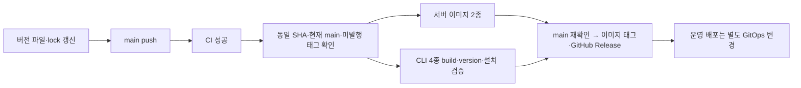

# 버전과 CLI 배포

## 이름과 버전

| 대상 | 계약 |
|---|---|
| CLI 패키지·실행 파일 | `gscli` (Grove Storage CLI) |
| 서버·이미지·저장소 | `filegate` 유지 |
| CLI 연결 | `GROVE_ENDPOINT`, `GROVE_OPERATOR_TOKEN`, `--token-file` 유지 |
| 배포 채널 | `cagojeiger/filegate` GitHub Releases의 독립 실행 파일 |
| 패키지 버전 | 서버·CLI가 workspace의 `MAJOR.MINOR.PATCH`를 공유 |
| 버전 정합성 | `VERSION` = `Cargo.toml` workspace = 내부 패키지 `Cargo.lock` |
| API 호환성 | `/api/admin/v1` 계약으로 관리; 서버·CLI 버전 숫자의 일치를 요구하지 않음 |
| JSON 출력 | CLI envelope의 `schema_version: 1`로 별도 관리 |
| 업데이트 | `gscli update`로 최신 안정 버전 설치; `update --check`는 확인만 수행 |
| 버전 고정·이전 버전 | 설치 스크립트의 `--version X.Y.Z`로 명시적 재설치 |
| 자동 업데이트 | 일반 명령은 설치된 버전으로 실행; 업데이트는 명시적 명령에서 수행 |

| 릴리스 계열 | 관리 기준 |
|---|---|
| `0.3.x` | Terraform provider가 등록부를 관리 |
| `0.4.x` | `gscli`가 등록부를 관리하며 CLI 전환 기능을 이 계열에서 안정화 |

NoteGate CLI의 workspace 버전·GitHub Release 바이너리 패턴을 따른다.
첫 배포에 수동 업데이트를 포함한다. 프로필·키체인은 후속 범위다.
첫 CLI 자산은 `v0.4.0`에서 발행한다. 현재 개발 버전은 `v0.4.1`이다.
기존 `v0.3.10`에는 CLI 자산이 없다.

## 설치

| OS | 아키텍처 | 자산 target |
|---|---|---|
| Linux (glibc, Ubuntu 22.04 빌드) | x86_64 | `x86_64-unknown-linux-gnu` |
| Linux (glibc, Ubuntu 22.04 빌드) | arm64 | `aarch64-unknown-linux-gnu` |
| macOS | Intel | `x86_64-apple-darwin` |
| macOS | Apple Silicon | `aarch64-apple-darwin` |

빌드 환경은 [GitHub 호스팅 러너](https://docs.github.com/en/actions/reference/runners/github-hosted-runners)의
Ubuntu 22.04·macOS 15 네이티브 러너를 사용한다.

아래 `X.Y.Z`에 CLI 자산이 발행된 릴리스 버전을 지정한다.

```sh
version=X.Y.Z
curl --fail --show-error --location --proto '=https' --proto-redir '=https' \
  "https://github.com/cagojeiger/filegate/releases/download/v${version}/gscli-installer.sh" \
  --output gscli-installer.sh
sh gscli-installer.sh --version "$version"
~/.local/bin/gscli --version
```

| 항목 | 설치 동작 |
|---|---|
| 필요 도구 | POSIX sh, curl, sha256sum 또는 shasum |
| 경로 | 기본 `~/.local/bin/gscli`; `--bin-dir /absolute/path`로 변경 |
| 다운로드 | 고정 `vX.Y.Z` HTTPS URL의 바이너리·SHA-256 |
| 검증 | SHA-256 확인 후 실행 파일의 `--version` 대조 |
| 교체 | 동일 디렉터리의 임시 파일 검증 후 rename; 검증 실패 시 기존 파일 유지 |
| 설치 기록 | `gscli-install-receipt.json`: schema_version·managed_by·repository·install_path·target |
| 경로 안전성 | 기존 symlink·디렉터리는 그대로 보존하고 오류 반환 |
| 사용자 설정 | shell rc·PATH·서버 설정·토큰을 수정하지 않음 |
| 신뢰 경계 | GitHub 저장소·릴리스 게시 권한·HTTPS를 신뢰; 체크섬은 별도 서명이 아님 |

소스 설치는 `cargo install --path backend/crates/cli --locked`로 수행한다.
해당 방식의 기본 설치 위치는 Cargo의 bin 디렉터리이므로 실행 시 `command -v gscli`로 경로를 확인한다.

## 업데이트

```sh
gscli update --check
gscli update
gscli update --check --output json
```

| 항목 | 계약 |
|---|---|
| 대상 | 공식 installer의 설치 기록이 현재 실행 파일의 경로·플랫폼과 일치하는 설치본 |
| 독립성 | 관리 서버·DB·endpoint·운영자 토큰 없이 GitHub Release만 사용 |
| 최신 버전 | latest manifest를 한 번 읽고 정수 3자리 안정 버전을 검증; 자산은 고정 `vX.Y.Z` URL 사용 |
| check | `update_available` 또는 `up_to_date`, exit 0; 자산 다운로드·파일 변경 없음 |
| update | 더 최신일 때 `updated`, exit 0; 이미 같거나 더 새로우면 `up_to_date` |
| 버전 판단 | 잠금 획득 후 설치 경로의 실행 파일 `--version` 확인; 오래된 프로세스의 버전으로 판단하지 않음 |
| 동시 실행 | installer·updater가 `.gscli-update.lock`의 같은 OS 잠금 사용; 충돌은 exit 6 |
| 다운로드 | HTTPS·지정 GitHub 호스트 redirect만 허용, 인증 헤더 없음, 자동 재시도 없음 |
| 검증 | manifest 최대 256 KiB, 자산 최대 100 MiB, 크기·SHA-256·후보 `--version` 확인 |
| 제한시간 | `--timeout`은 다운로드 전체 예산(기본 30초); 실행 파일 검사는 각각 최대 5초·출력 256 bytes 미만 |
| 교체 | 임시 파일을 닫고 검증한 뒤 atomic rename; 새 버전은 다음 CLI 실행부터 사용 |
| JSON | 기존 envelope 사용, `command=update` 또는 `update.check`, `endpoint=null` |
| 결과 data | status·current_version(교체 전)·latest_version·target·path·updated |

설치 기록은 관리 주체를 식별하는 정적 문서이며, 버전의 정본은 실제 실행 파일이다.
업데이트는 바이너리 한 개만 교체하므로 버전과 receipt를 따로 갱신하는 불일치를 줄인다.
설치 스크립트는 검증한 바이너리의 내부 설치 진입점을 호출해 receipt·잠금·교체 구현을 공유한다.
이 `__install --bin-dir PATH` 호출 규약은 기존 설치 스크립트와 호환되게 유지한다.
설치 디렉터리는 사용자가 관리하는 쓰기 가능한 경로를 전제로 한다.
하나의 설치 경로는 하나의 관리 주체가 소유한다. Cargo·패키지 관리자로 소유권을 넘길 때
`gscli-install-receipt.json`을 제거하며, 서로 다른 관리 방식에는 별도 설치 디렉터리를 사용한다.
설치 기록은 이후 다른 도구가 같은 파일을 덮어쓴 사실을 자동 감지하지 않는다.

| 실패 | 결과 |
|---|---|
| 설치 기록 없음·경로/플랫폼 불일치·symlink | `unmanaged_install`, exit 2; 공식 installer로 재설치 |
| 네트워크·manifest·체크섬·후보 실행 실패 | exit 5, 기존 파일 보존 |
| 로컬 파일 접근·교체 전 쓰기 실패 | exit 1, 기존 파일 보존 |
| rename 후 디렉터리 동기화·설치 기록 저장 실패 | `update_applied_incomplete`, exit 8·outcome=applied; 공식 installer로 상태 복구 |
| 교체 적용 후 stdout 출력 실패 | exit 8, stderr에 적용 사실 표시; JSON 본문 전달은 보장되지 않음 |

교체 전 실패는 `outcome=not_applied`다. 교체 후 기능 회귀는 자동 롤백 대신 지정 버전 재설치로 복구한다.
Cargo·패키지 관리자 설치본은 해당 도구로 갱신하거나 공식 installer 설치본으로 명시적으로 전환한다.

## 발행



1. `VERSION`과 workspace 버전을 함께 갱신하고 `cargo check --workspace`로 lock을 반영한다.
2. `python3 deploy/ci/check-version.py`와 CI를 통과한다.
3. Release는 CI가 성공한 main push의 SHA를 checkout한다. 기존 태그는 보존한다.
4. 네 플랫폼 바이너리·SHA-256, `gscli-manifest.json`, `gscli-installer.sh`를 발행한다.

버전 형식은 정수 3자리 SemVer다. 기능 추가는 minor, 호환되는 수정은 patch,
계약을 깨는 변경은 별도 호환성 검토와 릴리스 노트를 동반한다.
서버·CLI 어느 쪽을 바꾸더라도 같은 릴리스 번호로 묶는 단순성을 선택한다.

| 상황 | 처리 |
|---|---|
| CI 실패·PR 이벤트 | 발행 생략 |
| 빌드 전 main이 전진 | 오래된 실행 생략; 현재 main의 성공 CI가 미발행 버전을 회수 |
| 빌드 중 main이 전진 | 발행 단계에서 중단; 현재 main CI 뒤에 다시 진행 |
| 일반 커밋·기존 버전 | 기존 태그를 그대로 유지하고 생략 |
| 버전 변경으로 과거 태그 재사용 | 오류; 새 버전 선택 |
| 부분 발행 실패 | 이미지 digest·태그 SHA·Release 자산을 대조한 뒤 수동 복구 또는 새 버전 발행 |

GHCR 이미지 태그와 GitHub Release는 서로 다른 서비스의 발행이다.
이미지 발행 후 Release가 실패할 수 있으며, 기존 태그·자산을 자동 덮어쓰는 복구는 수행하지 않는다.
manifest는 `schema_version`, `version`, `repository`, target별 `name/sha256/size`를 담는다.

## 검증

| 검사 | 위치 |
|---|---|
| 버전·태그·stale SHA | `deploy/tests/test_version.py` |
| 자산 누락·체크섬·manifest | `deploy/tests/test_manifest.py` |
| 설치·실패 보존·플랫폼·버전 고정 | `deploy/tests/test_installer.py` |
| 업데이트·다운로드·동시성·손상·timeout | `backend/crates/cli/src/update/tests/{install,transfer}.rs` |
| 교체 후 저장·동기화 실패·재설치 복구 | `backend/crates/cli/src/update/tests/recovery.rs` |
| 업데이트 명령·인증 독립성 | `backend/crates/cli/tests/update.rs` |
| 실제 바이너리 설치 | Release의 각 네이티브 빌드, 임시 디렉터리·다운로드 fixture |
| 실제 바이너리 업데이트 | Release의 `native_release_artifact` 테스트, 로컬 HTTP fixture → 검증·교체·실행 |
| 원격 조회·변경 계약 | `backend/crates/cli/tests`, `scripts/e2e-cli.py` |

릴리스 보조 도구·테스트는 Python 3.11+를 사용하며, 사용자 설치는 Python 없이 동작한다.
