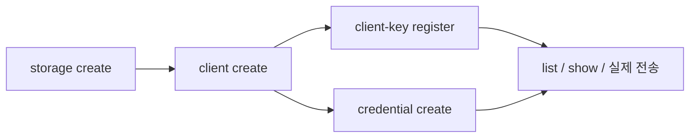
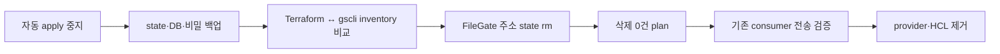

# 등록부 운영

`gscli`은 `/api/admin/v1`을 호출하고 PostgreSQL 등록부를 변경한다.
배포 설정과 서비스 비밀 전달은 GitOps·Vault가 계속 소유한다.

## 연결

```sh
export GROVE_ENDPOINT=https://filegate.example.com
export GROVE_OPERATOR_TOKEN="$(cat /path/to/operator-token)"
gscli status
```

| 입력 | 우선순위·형식 |
|---|---|
| endpoint | `--endpoint` → `GROVE_ENDPOINT` |
| token | `--token-file` → `GROVE_OPERATOR_TOKEN` |
| 출력 | `--output table|json`, 기본 table |
| 제한시간 | `--timeout SECONDS`, 기본 30 |

## 등록



S3 storage spec은 vendor secret을 포함한다. 입력 파일은 운영 비밀 경로에서 만든다.

```sh
umask 077
cat > primary.json <<'JSON'
{
  "kind": "s3",
  "endpoint": "https://s3.example.com",
  "public_endpoint": "https://s3.example.com",
  "region": "us-east-1",
  "bucket": "objects",
  "force_path_style": true,
  "access_key": "ACCESS_KEY",
  "secret_key": "SECRET_KEY",
  "capacity_bytes": 1099511627776
}
JSON

gscli storage create primary --from primary.json
gscli client create notegate --storage primary
gscli client-key register --client notegate --key-file /path/to/existing-client-key
gscli credential create --client notegate --secret-out /secure/notegate-s3.json
```

| 명령 | 입력·결과 |
|---|---|
| `storage create ID --from PATH` | JSON에 ID를 추가해 등록 |
| `storage replace ID --from PATH` | 전체 spec 교체; S3 secret 재제출 |
| `client create ID --storage STORAGE` | client를 storage 하나에 배치 |
| `client-key register --client ID --key-file PATH` | raw key의 SHA-256만 전송 |
| `credential create --client ID --secret-out PATH` | 새 파일에 일회성 access key·secret 저장 |

`--from -`은 storage JSON 한 개를 stdin에서 읽는다. storage 입력은 최대 1 MiB,
client key 파일은 최대 8 KiB다. credential 파일은 새 경로에 Unix `0600`으로 생성된다.

## 변경과 삭제

```sh
gscli storage list --output json
gscli storage show primary --output json
gscli client list --output json
gscli client show notegate --output json
gscli client-key list --client notegate --output json
gscli credential list --client notegate --output json

gscli credential delete --client notegate ACCESS_KEY_ID --yes
gscli client-key delete --client notegate sha256:HASH --yes
gscli client delete notegate --yes
gscli storage delete primary --yes
```

| 실행 환경 | replace·delete 확인 |
|---|---|
| TTY | endpoint·대상 확인 뒤 `yes` 입력 |
| 비TTY | `--yes` 필수 |
| 서버 참조 제약 | `--yes`와 독립적으로 409 반환 |

CLI는 변경 요청을 자동 재시도하지 않는다. 오류의 `outcome`이 다음 조치를 정한다.

| outcome | 의미 | 조치 |
|---|---|---|
| `not_applied` | 서버가 거부했거나 요청 전에 중단 | 입력 수정 후 재실행 |
| `unknown` | 단절·timeout·redirect·5xx로 결과 미확정 | list/show로 확인 후 결정 |
| `applied` | 성공 응답 뒤 해석·비밀 저장·출력 실패 | 현재 등록 상태를 확인하고 후속 정리 |

## Terraform 이관



| 게이트 | 완료 기준 |
|---|---|
| 자동화 동결 | 이관 중 Terraform apply 0회 |
| 복구 재료 | state·PostgreSQL·마스터 키·consumer key·vendor secret 보존 |
| 공개 inventory | storage 공개 필드·client 배치·client key hash·credential ID가 기대값과 일치 |
| 비밀 복구 | 조회되지 않는 vendor secret·consumer raw key·S3 secret의 원본 또는 재발급 절차 확보 |
| state 분리 | `filegate_*` 주소만 `terraform state rm` |
| plan | FileGate API 리소스 삭제 0건 |
| 소비자 검증 | 기존 네이티브·S3 자격증명으로 업로드·다운로드 성공 |

```sh
umask 077
terraform -chdir=/path/to/gitops state pull > filegate-before.tfstate
terraform -chdir=/path/to/gitops state list | grep 'filegate_'

gscli storage list --output json
gscli client list --output json
gscli client show notegate --output json
gscli client-key list --client notegate --output json
gscli credential list --client notegate --output json

terraform -chdir=/path/to/gitops state rm \
  'filegate_storage_s3.primary' \
  'filegate_client.notegate' \
  'filegate_client_key.notegate'
```

`state rm`은 API 리소스를 유지하고 Terraform 소유권만 분리한다. 실제 운영 주소는
module prefix를 포함한 `state list` 결과에서 선택한다. storage 조회에는 vendor secret이
포함되지 않는다. 이관 완료 전에는 Terraform 예제와 provider를 비교 기준으로 유지한다.

이관 후 PostgreSQL의 현재 상태가 정본이며, `gscli list/show/status`로 관찰하고 변경 명령을
명시적으로 실행한다. Terraform의 desired-state 재적용은 등록부 운영 경로에서 제외한다.
