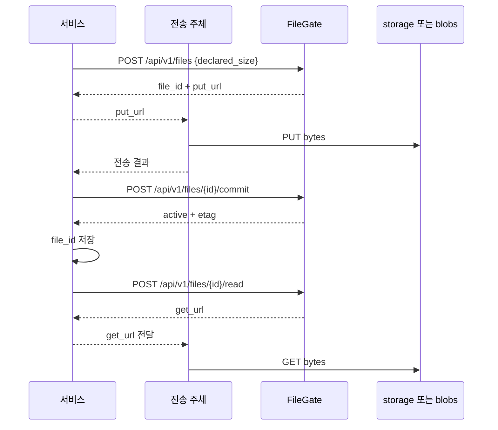

# 네이티브 연동

계약: [파일](../spec/00-operations.md) · [multipart](../spec/02-multipart.md)

## 준비

| 항목 | 제공 주체 |
|---|---|
| storage·client 등록 | [운영자 API](../spec/01-registry.md) |
| client bearer 키 | 운영자 |
| endpoint | FileGate 실행 환경 |
| 사용자 권한·안정 URL | 서비스 |

서비스는 file_id를 저장하고, 전송 때 발급된 URL을 사용한다.

## 업로드·다운로드



전송 주체는 브라우저 또는 서비스 서버다. URL 목적지는 storage 직결 또는 FileGate 중계다.

| 상황 | 처리 |
|---|---|
| 단일 PUT 완료 | commit의 active 확인 |
| 단일 PUT의 commit 생략 | reconciler가 선언과 실물을 대조해 자동 확정 |
| multipart 서술자 수신 | 받은 part_size대로 분할, parts API로 URL 발급 |
| part 재시도 | 같은 번호의 URL 재발급·재전송 |
| 미확정 만료 | FileGate가 회수·물리 정리 |
| 조회 | GET /api/v1/files/{id} |
| 삭제 | FileGate DELETE + 서비스 DB 관계 정리 |

multipart는 명시적 commit으로 완료한다. URL·키 회전·복구 중 오류와 재시도 조건은
spec을 따른다.

## 저장하는 정보

```text
서비스 DB  → 업무 소유자·파일명·권한·filegate_file_id
FileGate DB → 위치·크기·상태·lease·사용량
```

| 표면 | 인증 |
|---|---|
| /api/v1/* | client bearer 키 |
| 발급된 바이트 URL | URL의 secret·서명·만료 |
| /api/admin/v1/* | operator bearer 토큰 |
