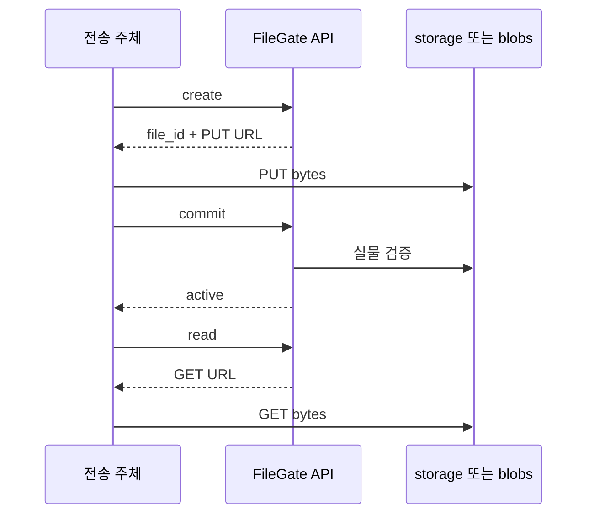
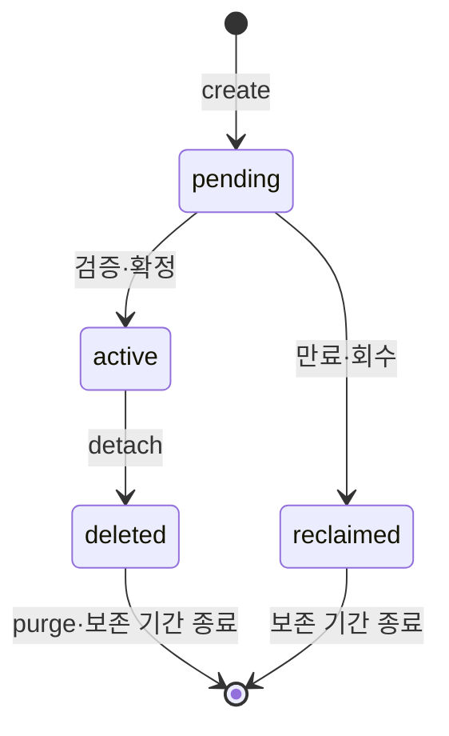

# spec 00: 네이티브 파일과 수명주기

- 상태: 현재 구현 계약
- 근거: ADR [002](../adr/002-lease-model.md)·[003](../adr/003-url-ownership.md)·[005](../adr/005-presigned-byte-plane.md)
- S3 요청 계약: [spec 03](03-s3-surface.md)

## API

인증은 client bearer 키다. 서비스는 사용자 권한을 확인하고 `file_id`를 저장한다.

| 동작 | 요청 | 결과 |
|---|---|---|
| create | `POST /api/v1/files`, declared_size·선택 content_type/declared_md5 | pending 파일·write lease·PUT URL 또는 multipart 서술자 |
| commit | `POST /api/v1/files/{id}/commit` | 실측 검증 뒤 active·ETag |
| read | `POST /api/v1/files/{id}/read`, 선택 filename | 현재 location의 GET URL |
| stat | `GET /api/v1/files/{id}` | 자기 파일의 pending/active/deleted·크기 |
| delete | `DELETE /api/v1/files/{id}` | active → deleted, 후속 물리 purge |

| 조건 | 처리 |
|---|---|
| 크기 0 | 유효한 업로드 |
| 단일 PUT | 최대 5GiB; 임계 초과는 [multipart](02-multipart.md) |
| 배치 | client.storage_id |
| 명시적 commit | 선언 크기·선택 MD5를 실물과 대조 |
| 검증 실패 | pending 유지, lease 유효기간 내 재시도 |
| 단일 PUT 관찰 | 실물이 선언과 일치하면 reconciler가 자동 확정 |
| multipart | 명시적 완료로 확정 |
| 읽기·쓰기 URL | 기본 TTL 15분; 접근 종류별 원장 검사 |
| reclaimed 파일 | 네이티브 stat에서 404 |
| deleted 행 | 보존 기간 중 stat 가능, 정리 후 404 |



## 전송 모드

| 모드 | 바이트 경로 | 크기·확정 조건 |
|---|---|---|
| S3 직결 | 전송 주체 ↔ 외부 저장소 | commit/관찰 시 검증; 발급된 URL은 vendor TTL까지 유효 |
| fs·force_relay | 전송 주체 ↔ FileGate ↔ 저장소 | 스트림 크기·MD5 계측 후 확정 |
| blobs 인증 | `/blobs/{lease}?s=...` | lease secret·상태·만료 |
| blobs Content-Length | 필수 | 누락 411, 선언과 불일치 400, 초과 413 |
| 단일 blobs PUT 소유권 | 수신 전 file→lease 행 잠금 | 수신·저장·실측 기록 동안 commit/회수와 직렬화; 완료 시 TTL 15분 갱신 |
| 단일 blobs PUT 동시 요청 | 이미 소유 중이면 409 | 대기 슬롯 획득 후 만료·pending 상태 재검사 |
| 단일 blobs PUT 재전송 | pending 상태에서 같은 크기·MD5는 200 | 성공한 바이트는 유지; 다른 내용은 409, 새 파일로 생성 |
| 선언 MD5 불일치 | 물리 저장 전 400 | 같은 URL로 올바른 내용 재시도 |
| 브라우저 | 설정된 CORS allowlist | preflight 처리 |
| fs 쓰기 | 같은 filesystem의 임시 파일 → rename | 원자적 이름 전환 |

파일명 표현은 RFC 5987로 인코딩한다. 서비스 URL은 서비스가 소유하고,
발급된 접근 URL을 유효기간 내 전달한다.

단일 중계 PUT과 fs part 승격은 파드당 4개의 DB claim 슬롯을 공유한다.
단일 PUT은 수신 동안 연결 하나를 점유한다. 요청 취소 시 트랜잭션을 롤백하고,
처음 업로드의 물리 저장 후 DB 기록이 실패하면 실측 없이 pending으로 남아
재전송 또는 만료 회수한다. 확정 이후 중계 PUT은 기존 lease 인증에서 거부한다.

## 상태와 정리



| 작업 | 보존·제거 조건 |
|---|---|
| generic 회수 | native/S3 완료 소유 행을 제외하고 pending→reclaimed 선점, location·lease 보존 |
| 회수 실물 정리 | reclaimed+location을 재조회, 물리 삭제 성공 뒤 location 해제; 실패는 다음 tick에서 재시도 |
| purge | 물리 삭제 성공 뒤 location 제거 |
| 완료 복구 | [native multipart](02-multipart.md#완료와-복구)·[S3](03-s3-surface.md#완료와-복구) |
| read lease 정리 | 만료를 expired로 기록 |
| terminal lease GC | 24시간 보존, S3 세션·native completion·location이 남은 reclaimed 파일 보호 |
| terminal file GC | 90일 보존, location·lease 정리가 끝난 reclaimed/deleted 행 |
| lease_history | 90일 보존 |

## 사용량

운영자 API의 `/usage`, `/usage/clients`, `/usage/history?days=N`에서 관찰한다.

| 관찰 | 계산 |
|---|---|
| reserved | pending 선언 크기 합 |
| active | 활성 점유 |
| purge_pending | deleted 또는 reclaimed 중 location이 남은 선언 크기·파일 수 |
| remaining | 등록 capacity − reserved − active − purge_pending |
| client × storage | 활성 파일 수·바이트 |
| history | 일별 활성 점유 스냅샷 |

회수 선점은 늦은 commit을 차단하고 reserved를 해제한다. 물리 정리가 끝날 때까지
같은 선언 크기를 purge_pending에 포함하므로 실패 시 remaining이 조기에 증가하지 않는다.
물리 바이트의 실측값이 아니라 보수적인 선언 크기 기준이다.

이 동작은 기존 스키마를 사용한다. 배포 시 이전 reconciler들을 중지하고 새 버전으로
전환한다. 이전 버전은 reclaimed 정리 재시도·lease 보호를 지원하지 않는다.
이미 구버전이 location을 제거한 고아 객체는 이 변경만으로 복원되지 않는다.

capacity는 등록 기준선이고 실제 filesystem 여유 공간과 구분한다.
점유는 files·locations에서 조회 시 집계한다. 일별 스냅샷은 UTC 자정 이후 첫 tick의
관찰을 전날 값으로 기록하며, 늦게 실행된 값은 근사치다. 빠진 날은 비어 있고
이미 기록한 날은 유지한다.

## 물리 이름과 복구

```text
S3:   fg/{client}/{yyyy}/{mm}/{file_id}[.ext]
fs:   fg/{client}/{yyyy}/{mm}/{zz}/{file_id}[.ext]
temp: .fg-tmp-{lease_id}-{random}
```

create 시각은 UTC, `zz`는 file_id 마지막 두 hex다. 확장자는 content_type 허용목록에서
선택한다. 읽기·삭제는 location에 저장한 경로를 사용한다.

| 재료 | 복구 범위 |
|---|---|
| 물리 경로·파일 | file_id·client·시기·실제 크기·재해싱 |
| PostgreSQL 백업 | 논리키 매핑·배치·상태·삭제 결정·사용량 스냅샷·대여 이력 |
| DB 암호문 + 마스터 키 | storage·S3 자격증명 |
| 서비스 DB | 네이티브 file_id의 업무 의미 |

논리키와 삭제 결정은 물리 파일명에서 복원되지 않으므로 DB·데이터·마스터 키를 함께 보존한다.
48시간 지난 임시는 sweep 대상으로 삼고, 공유 fs의 multipart 임시는 활성 lease 목록으로
보호한다. 보호 목록 조회가 실패하면 해당 sweep을 건너뛴다. 일반 고아 객체 감사는 후속 범위다.
