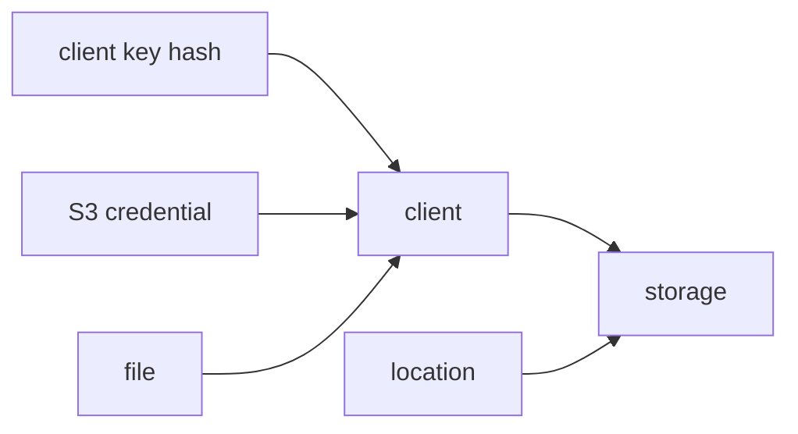

# spec 01: 등록부와 운영자 제어

- 상태: 현재 구현 계약
- 근거: [ADR 004](../adr/004-config-layers.md)
- 관리 CLI: [spec 04](04-cli.md) (gscli 조회·변경 구현)

## 등록 관계

PostgreSQL이 정본이고 운영자 API가 변경 경계다. `gscli`과 API 클라이언트가
같은 변경 계약을 사용한다. 기존 Terraform 예제는 운영 이관 전 비교 기준이다.

| 리소스 | `/api/admin/v1` 아래 경로 | 동작 |
|---|---|---|
| storage | `/storages`, `/storages/{id}` | 생성·목록·조회·갱신·삭제 |
| client | `/clients`, `/clients/{id}` | 생성·목록·조회·삭제 |
| client key | `/clients/{id}/keys[/{key_hash}]` | 해시 등록·목록·조회·삭제 |
| S3 credential | `/clients/{id}/s3-credentials[/{access_key_id}]` | 발급·목록·삭제 |
| usage | `/usage`, `/usage/clients`, `/usage/history` | 조회 |

## 저장소와 배치

| 조건 | 계약 |
|---|---|
| id | 운영자가 지정한 안정 슬러그, 생성 후 고정 |
| fs | 준비된 root_path·capacity_bytes |
| S3 | endpoint·public_endpoint·region·bucket·자격증명 |
| 중계 storage | 서버에 FILEGATE_PUBLIC_URL 설정 |
| 등록·부팅 | 저장소 접근 검증 |
| client 배치 | 생성 시 storage_id 하나 지정 |
| storage 삭제 | client·location 참조가 정리된 뒤 수행 |
| client 삭제 | 파일 정리 후 수행, 키·S3 자격증명·논리키는 cascade |

현재 fs 검증은 디렉터리 존재·쓰기 가능 확인이다. mount 식별·상실 정책은
[Grove 경계](../adr/007-grove-storage-foundation.md)에서 추가로 정한다.

외부 S3 자격증명은 객체 I/O와 multipart 생성·part 조회/쓰기·완료·중단·열린 multipart
목록 조회 권한을 가진다. 열린 목록 조회는 불명확한 Create 결과에서 object_key로
vendor 세션을 재발견하는 내부 복구에 사용한다.

## 키와 비밀

| 비밀 | 공급·저장 | 회전 |
|---|---|---|
| 운영자 토큰 | env FILEGATE_OPERATOR_TOKENS, 쉼표 목록·상수시간 비교 | 새 토큰 추가 → 소비자 전환 → 옛 토큰 제거 |
| client 키 | 생성자가 raw 전달, API에는 sha256:64hex 등록 | 해시 추가 → 소비자 전환 → 옛 해시 삭제 |
| S3 secret | 서버 생성·발급 시 1회 반환, AES-GCM 저장 | 재발급 → 소비자 전환 → 옛 자격증명 삭제 |
| storage secret | 운영자가 제출, 접근 검증 후 AES-GCM 저장 | 새 vendor 키로 storage 갱신 |
| 마스터 키 | env FILEGATE_ENC_ROOT_SECRET·ENC_KEY_ID | 아래 절차 |

암호문은 enc_key_id로 복호 키를 선택한다. AAD는 storage id 또는 S3 access key id다.
메모리 비밀은 SecretString으로 다룬다.

| 마스터 키 회전 단계 | 완료 조건 |
|---|---|
| 현재 키를 PREV 쌍으로, 새 키를 활성으로 롤아웃 | 이전·현재 암호문 복호 가능 |
| storage secret을 운영자 API로 다시 제출 | 활성 키로 재암호화 |
| S3 자격증명 재발급·소비자 전환·옛 행 삭제 | 새 자격증명 사용 |
| 두 테이블의 enc_key_id 확인 후 PREV 제거 | 모든 암호문이 새 키 사용 |

기존 API는 S3 secret 재암호화 갱신 대신 재발급을 제공한다.
storage 복호 오류는 부팅 검증에서, S3 credential 오류는 인증 시 드러난다.
DB 백업·마스터 키·소비자 시크릿을 각 공급 경로에서 보존한다.
