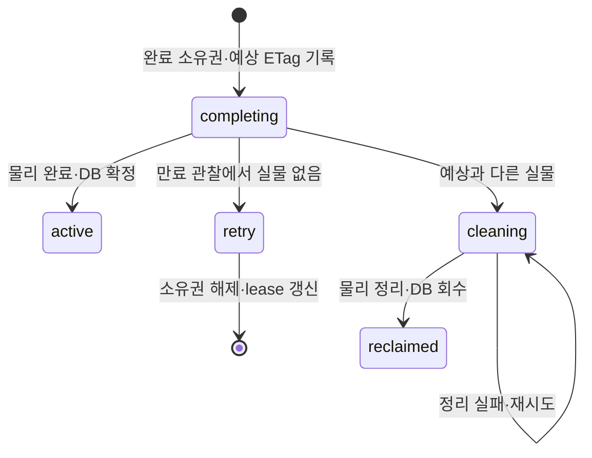

# spec 02: 네이티브 multipart

- 상태: 현재 구현 계약
- 근거: [ADR 002](../adr/002-lease-model.md)
- S3 multipart: [spec 03](03-s3-surface.md)

## 요청 계약

| 단계 | 입력 | 결과 |
|---|---|---|
| create | declared_size > 임계값 | file_id + multipart {part_size, part_count} |
| parts | file_id + part 번호 목록 | part별 URL·write lease 갱신 |
| PUT part | 발급된 URL·해당 part 바이트 | 계측·part 기록 |
| commit | file_id | part 검증·물리 완료·active 확정 |
| 재개 | 같은 part 번호 재발급 | part 단위 재전송 |
| 만료 | write lease 만료 | 회수·물리 Abort/임시 정리 |

| 규칙 | 계약 |
|---|---|
| part_size | create 시 동결; 개수·offset은 declared_size와 동결값으로 계산 |
| part 범위 | 균일 크기, 마지막 part는 나머지 |
| 전체 상한 | part_size × 10000, vendor 한계도 적용 |
| declared_md5 | multipart create에서 400; 검증 단위는 part |
| 계측 | Content-Length·part 크기 확인, 크기·MD5 기록 |
| 같은 part | 순차 재업로드는 덮어쓰기, 동시 승격은 claim으로 직렬화 |
| ETag | part MD5들의 합성 digest + -N |
| read/stat | active 확정 전 read는 409, stat은 pending |
| 설정 | [.env.example](../../.env.example)의 임계값·part 크기 |

## 물리 처리

| backend | 전송 | 완료 |
|---|---|---|
| S3 직결 | vendor part URL, upload_id를 lease에 기록 | ListParts 대조 → vendor Complete |
| S3 중계 | 스풀 계측 → vendor UploadPart | 원장 대조 → vendor Complete |
| fs | 스풀 계측 → claim → 고정 offset에 기록 | 검증 → 조립 파일 rename |

fs의 offset은 `(N-1) × part_size`다. 서로 다른 part는 별도 범위에 쓰며,
같은 part는 DB claim이 보호한다. 중계 secret은 마스터 키와 lease id에서 파생한다.
해당 키를 PREV에서도 제거한 뒤 재발급하면 409가 되어 새 업로드로 시작한다.

## 완료와 복구

| 경계 | 조건 |
|---|---|
| 완료 선점 | part 검증 후 native_multipart_completions 기록·lease 연장 |
| 물리 작업 | heartbeat로 완료 소유권 유지 |
| 새 part·generic 회수 | 완료 소유 행으로 직렬화 |
| 직결 UploadPart | vendor Complete가 검증한 part 번호·ETag 목록으로 직렬화 |
| 복구 시점 | heartbeat가 끝나고 lease가 만료된 뒤 |
| 예상 실물 일치 | DB 확정 재시도; fs는 크기, S3는 크기·ETag 대조 |
| 실물 없음 | 완료 소유권 해제·lease 갱신, commit 재시도 |
| 실물 불일치 | cleaning 선점·물리 정리 성공 뒤 reclaimed |
| 정리 실패 | completion·location·lease·upload_id 보존 |
| terminal lease GC | 완료 소유 파일의 복구 재료 보호 |

파일 행 잠금 획득 후 별도 쿼리로 완료 소유권·lease 상태를 다시 읽는다.
part 허용·heartbeat·최종 확정은 잠금 대기 후의 현재 상태로 판단한다.

직결 presigned part는 vendor TTL까지 유효하다. DB 소유권은 회수·재발급을 제어하고,
실제 외부 part 변경과 Complete의 경합은 vendor 세션이 결정한다.
부족한 part·크기 불일치의 commit은 400으로 pending을 유지한다.

## 검증

| 범위 | 근거 |
|---|---|
| 완료·회수 경합, 새 part 차단, 재개·정리, GC | db/tests/native_multipart_completion.rs |
| 잠금 대기 중 소유권 변경 | db/tests/native_multipart_completion/ |
| S3 중계 part·완료 직렬화 | db/tests의 S3 multipart 테스트 |
| 실제 fs·S3 바이트 동등성 | scripts/e2e-multipart.sh |
| part 내부 오프셋 재개·전체 CRC 합성 | 후속 범위 |
