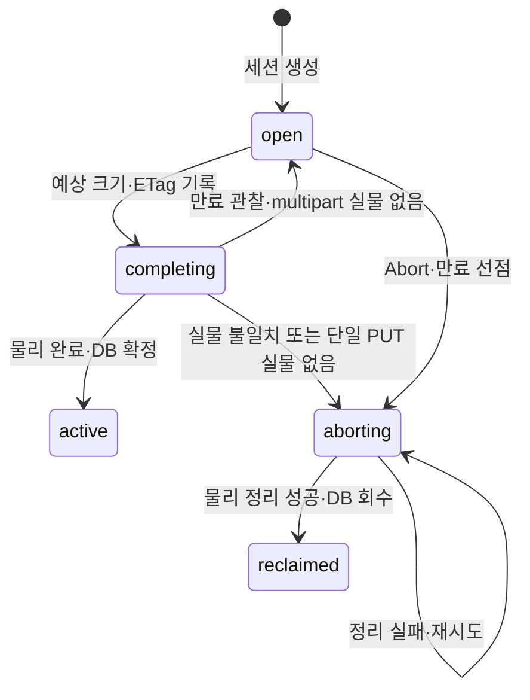

# spec 03: S3 호환 API

- 상태: 현재 구현 계약
- 근거: [ADR 006](../adr/006-s3-compat-surface.md)
- 실행 예: [S3 연동](../guide/s3-onboarding.md)

## 지원 오퍼레이션

| 동작 | 요청 | 성공 | 주요 실패 |
|---|---|---|---|
| PutObject | PUT /{bucket}/{key} | 200·ETag | 403·404·400 |
| HeadObject | HEAD /{bucket}/{key} | 200·객체 헤더 | 404 |
| GetObject | GET /{bucket}/{key} | 200·스트림 / 206·Range | 404·416 |
| DeleteObject | DELETE /{bucket}/{key} | 멱등 204 | 403 |
| CreateMultipartUpload | POST ?uploads | 200·XML UploadId | 403·404 |
| UploadPart | PUT ?partNumber=N&uploadId=U | 200·part ETag | 400·403·404·503 |
| CompleteMultipartUpload | POST ?uploadId=U + XML | 200·합성 ETag | 400·403·404·503 |
| AbortMultipartUpload | DELETE ?uploadId=U | 204 | 403·404·503 |

현재 검증 대상은 boto3의 객체 수명·upload_file/download_file·multipart다.
ListObjectsV2·ListBuckets·HeadBucket·CopyObject·ListParts·클라이언트용
ListMultipartUploads는 현재 지원 범위 밖이다.

## 주소·인증

| 항목 | 계약 |
|---|---|
| 리스너 | 컨트롤 API와 FILEGATE_BIND 공유 |
| 주소 | path-style /{bucket}/{key} |
| bucket | client_id와 일치; 다른 이름은 404 NoSuchBucket |
| 예약 경로 | api·blobs·healthz·readyz, 인코딩된 이름도 확인 |
| 예약 경로 처리 | S3 CORS·인증 전에 404; 실제 컨트롤 라우트는 자체 계약 |
| key | 디코딩한 서비스 소유 논리키; 재PUT은 매핑 교체 |
| 인증 | header-signed·query-signed SigV4 |
| 자격증명 | 운영자 API가 발급한 client 소유 access key·secret |
| canonical query | raw 인코딩 보존·정렬, X-Amz-Signature 제외 |
| query-signed | X-Amz-Date·Expires·SignedHeaders 검증 |
| secret 저장 | AES-GCM, AAD=access key id, enc_key_id로 복호 |
| 회전 | [등록부](01-registry.md#키와-비밀)의 재발급 절차 |

## 객체 전송

| 항목 | 계약 |
|---|---|
| 바이트 경로 | Client ↔ FileGate ↔ client의 storage |
| PUT 계측 | 크기·MD5·SHA256, 서명된 payload hash 대조 |
| PUT 확정 | 물리 쓰기 후 파일·lease·논리키·옛 파일 detach를 같은 DB transaction으로 처리 |
| PUT ETag | 실측 MD5, 따옴표 포함 |
| 단일 PUT 상한 | 5GiB |
| Range | bytes=a-b·bytes=a-; 시작이 크기 이상이면 416 |
| 기타 Range 형식 | 전체 응답 |
| 응답 override | 서명된 response-content-disposition/type/cache-control |
| override 검증 | percent decode 후 HeaderValue 검증; 제어문자는 400 InvalidArgument |
| checksum 헤더 | 서명 범위로 검증; CRC32 값의 본문 대조는 현재 제공하지 않음 |
| 접근 기록 | 내부 lease 원장 사용 |

## Multipart

S3는 part 크기를 클라이언트가 정한다. 네이티브의 declared_size 기반 offset 대신
part별 실측 크기와 완료 목록으로 조립한다.

| 단계 | 파일·세션 | 물리 처리 |
|---|---|---|
| Create | pending + open, (client, key, multipart)에 바인딩 | S3 backend는 vendor 세션 개시; fs는 part 도착 시 저장 |
| UploadPart | 계측 뒤 claimed 선점·done 기록 | S3 UploadPart 또는 fs part 파일 원자 교체 |
| Complete | 목록·ETag·실측 합 검증 → completing | S3 Complete 또는 fs partNumber 순 누계 offset 조립 |
| Abort | open → aborting | vendor 세션·임시·최종 객체 정리 후 DB 회수 |

| 경계 | 결과 |
|---|---|
| UploadId | file_id; vendor upload_id는 내부 lease에 저장 |
| 같은 part 순차 재업로드 | 덮어쓰기 |
| 같은 part 동시 승격 | 하나가 진행, 나머지 503 |
| 서로 다른 part | 병렬 가능 |
| part 진행 중 Complete/Abort | 503, 재시도 |
| Complete 목록 | 번호 오름차순·유일·원장에 존재·ETag 일치 |
| 객체 크기 | 완료 목록의 실측 합, part_size × 10000 상한 |
| ETag | part MD5들의 합성 digest + -N |
| completing 중 재Complete | 503 ServiceUnavailable |
| 없거나 다른 key·모드의 세션 | 404 NoSuchUpload |
| Abort가 먼저 선점 | 늦은 part가 물리 승격 전에 404 |

## 완료와 복구



| 조건 | 복구 계약 |
|---|---|
| 물리 작업과 DB | s3_uploads에 중간 상태를 기록하고 단계별 실행 |
| 작업 진행 | 파일 락 획득 후 별도 쿼리로 completing 확인, heartbeat로 write lease 연장 |
| 복구 후보 | completing의 만료된 write lease |
| 실제 전이 | 파일 락 아래 만료 재확인 |
| 예상 실물 일치 | 파일 활성화·lease 확정·key 교체·옛 파일 detach를 한 transaction으로 처리 |
| 관찰 근거 | 고유 object_key; fs는 크기, S3는 크기·ETag |
| 정리 실패 | session·location·lease·vendor upload_id 보존 |
| generic 회수·관찰·commit | s3_uploads 소유 파일을 제외 |
| terminal lease GC | 세션이 남은 파일의 복구 재료 보호 |
| vendor Create 결과 불명확 | 고유 physical object_key로 열린 multipart를 조회·중단 |

파일이 확정되거나 정리가 성공한 뒤 세션을 제거한다. 내부 vendor multipart 조회는
복구용 권한이며 클라이언트 API 지원과 별개다.

## 에러와 검증

```xml
<Error><Code>NoSuchKey</Code><Message>...</Message></Error>
```

| 종류 | 예 |
|---|---|
| 인증 | AccessDenied, InvalidAccessKeyId, SignatureDoesNotMatch, RequestTimeTooSkewed |
| 이름·세션 | NoSuchBucket, NoSuchKey, NoSuchUpload |
| 요청·본문 | InvalidArgument, MissingContentLength, EntityTooLarge, IncompleteBody, RequestTimeout, XAmzContentSHA256Mismatch |
| Range·XML·part | InvalidRange, MalformedXML, InvalidPart |
| 처리 | MethodNotAllowed, NotImplemented, InternalError, ServiceUnavailable |

DB 테스트는 선점·완료·회수·GC 경합을 검증한다. 실제 바이트 경로는
scripts/s3-capture.py의 단일 객체·Range·자동 multipart·key-bound Abort로 검증한다.
잠금 대기 중 복구 전이는 db/tests/s3_heartbeat_fencing.rs에서 실행 순서를 고정해 검증한다.
FileGate에서는 S3_EXPECT_WRONG_KEY_404=1로 다른 key의 Abort가 404인지 확인한다.

## 0005 이전 세션 전환

| 순서 | 작업 |
|---|---|
| 1 | 구버전 writer 종료·진행 요청 drain |
| 2 | storage 자격증명에 열린 multipart 목록 조회 권한 부여 |
| 3 | 새 writer로 migration 실행·서버 시작 |
| 4 | 이전 pending multipart는 새 업로드로 재시작, 기존 세션은 만료 회수 |

이전 세션에는 logical key가 없어 backfill 대신 재시작한다. 전환은 같은 DB에
구버전·신버전 writer가 겹치지 않는 순서로 수행한다.
