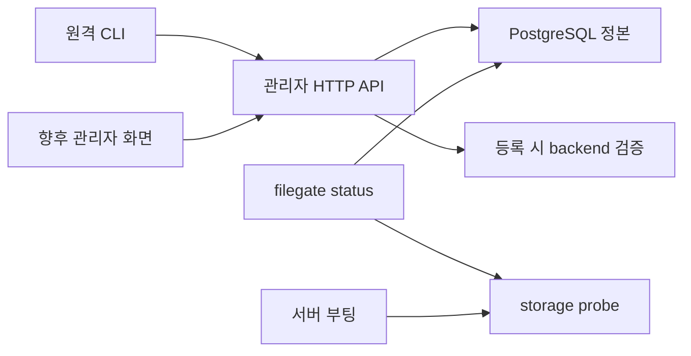

# spec 04: 운영 CLI

- 상태: Partial (gscli 조회·변경·자체 업데이트 구현, 운영 이관은 Draft)
- 원격 관리 CLI: `gscli`; 서버·기존 로컬 진단: `filegate`
- 관련 계약: [등록부](01-registry.md), [제품 경계](../adr/007-grove-storage-foundation.md)
- 첫 목표: 기존 등록·키·데이터를 보존하면서 FileGate 등록부의 Terraform 관리를 대체한다.

## 현재 구현과 다음 단계

| 항목 | 현재 구현 | 다음 단계 |
|---|---|---|
| 서버 진입점 | `filegate`·`filegate serve` 유지 | 서버 이름 전환은 별도 릴리스 |
| 원격 진단 | `gscli status`: HTTP 상태·등록부 요약 | 지원 서버 계약 확장 |
| 로컬 진단 | `filegate status`: DB·복호 키·저장소 접근 | doctor 명칭·probe 개선은 서버 측 별도 변경 |
| 관리 명령 | list·show·usage·create·replace·delete·register | Node·Agent 명령은 2차 |
| 인자·출력 | 변경 확인, table·버전 있는 JSON, 일회성 비밀 파일 | 연결 profile은 후속 |
| 테스트 | 설정·입력·HTTP·비밀·변경 결과·status 분리 | 실제 전송·운영 이관 |

근거: [main.rs](../../backend/crates/api/src/main.rs), [status.rs](../../backend/crates/api/src/status.rs).
기존 `filegate status`는 HTTP 서버 없이 실행되며 migration을 수행하지 않는다.
fs 검사는 probe 파일 쓰기·삭제를 포함한다. `gscli`은 이 로컬 진단을 포함하지 않는다.

## 책임 경계



| 구성 | 소유하는 일 |
|---|---|
| CLI | 인자·설정 검증, HTTP 요청, 비밀 파일 입출력, 출력·종료 코드 |
| 관리자 API | 인증, 리소스 검증·삭제 제약, DB 변경, 자격증명 발급 |
| filegate status | 서버 로컬 설정·DB·저장소 접근 진단 |
| 공통 storage 검사 | 서버 부팅과 기존 status가 같은 backend 검증 구현 사용 |
| GitOps·Vault | 프로세스 배포와 운영 비밀 전달 |
| CLI 로컬 파일 | 명시적으로 저장한 일회성 비밀 산출물; 등록부 정본은 PostgreSQL |

CLI는 기존 `/api/admin/v1`을 사용하는 독립 crate다. 서버·DB·infra crate 의존성 없이
HTTP 응답 모델을 소유하며, 등록부 정본과 변경 규칙은 API·PostgreSQL이 소유한다.
1차는 외부 S3 backend 등록·presigned 전송 지원을 유지하면서 등록부 관리를 CLI로 이관한다.
현재 fs backend·S3 중계 API는 현행 계약을 유지한다. 소비자 전환과 API 축소는 별도 결정한다.
2차의 Node·Agent 조인 명령은 별도 스펙으로 확장한다. 새 CLI만 `gscli` 이름을 사용하고,
기존 서버 바이너리·환경 변수·이미지·URL·자격증명은 유지한다.

## 명령 구조

현재 소스가 제공하는 원격 관리 명령이다. 소스 설치와 GitHub Release 바이너리 배포를 지원한다.
CLI 자산은 v0.4.0부터 발행한다. 서버 이미지는 `filegate`만 포함한다.
패키지 버전·설치·업데이트는 [릴리스 계약](../development/releases.md)을 따른다.

```text
gscli
├── update [--check]
├── status
├── storage
│   ├── list
│   ├── show ID
│   ├── create ID --from PATH
│   ├── replace ID --from PATH [--yes]
│   └── delete ID [--yes]
├── client
│   ├── list
│   ├── show ID
│   ├── create ID --storage STORAGE_ID
│   └── delete ID [--yes]
├── credential
│   ├── list --client CLIENT_ID
│   ├── create --client CLIENT_ID --secret-out PATH
│   └── delete --client CLIENT_ID ACCESS_KEY_ID [--yes]
├── client-key
│   ├── list --client CLIENT_ID
│   ├── register --client CLIENT_ID --key-file PATH
│   └── delete --client CLIENT_ID SHA256_HASH [--yes]
└── usage
    ├── storages
    ├── clients
    └── history [--days N]
```

`update`는 서버 인증과 독립적으로 최신 CLI를 설치하며, `--check`는 확인만 한다.
설치 기록·실패·출력 계약은 [업데이트](../development/releases.md#업데이트)를 따른다.

| 명령 | 기존 HTTP 계약 | 세부 조건 |
|---|---|---|
| storage list/show | GET /storages[/ID] | 응답의 secret 제외 유지 |
| storage create/replace | POST /storages, PUT /storages/ID | `--from`은 JSON spec, ID는 위치 인자로만 받음 |
| storage delete | DELETE /storages/ID | 참조 제약은 서버가 집행 |
| client list/show/create/delete | /clients[/ID] | create는 `--storage`; list는 ID 목록 |
| credential list/create/delete | /clients/ID/s3-credentials[/KEY] | `--secret-out`에 일회성 secret 저장 |
| client-key list/register/delete | /clients/ID/keys[/HASH] | `--key-file`의 raw key를 로컬 sha256 처리 |
| usage storages/clients/history | /usage[/clients 또는 /history] | history 기본 90일, 입력은 1–3650일 |

위 HTTP 경로의 prefix는 `/api/admin/v1`이다.
`--from -`은 stdin의 JSON 한 개를 읽는다. backend별 필드는 [등록부](01-registry.md)를 따른다.
입력 JSON에 `id`가 있으면 값의 일치 여부와 관계없이 요청 전에 거부한다.
create는 CLI가 위치 인자 ID를 JSON의 `id`에 추가해 POST하고, replace는 spec만 PUT한다.
`replace`는 전체 PUT이다. S3 secret을 다시 공급하며, show 결과만으로 원문 secret을 복구하지 않는다.
storage JSON은 최대 1 MiB이고 알 수 없는 필드·누락된 capacity_bytes를 요청 전에 거부한다.
client key 파일은 최대 8 KiB의 단일 ASCII bearer 값이며 끝의 LF 또는 CRLF 하나를 제외하고 해시한다.
client list는 현재 ID 배열을 표시하고, 자동 N+1 조회로 storage 정보를 채우지 않는다.
리소스 ID·키 해시는 URL 경로 세그먼트로 인코딩한다.

## 원격 status와 로컬 진단

| 명령 | 확인 범위 | 제외되는 보장 |
|---|---|---|
| gscli status | GET /, /healthz, /readyz, 관리자 /usage, /clients | 실물 무결성·backend 접근·워커 진행·전체 replica 건강 |
| filegate status | 기존 로컬 DB·등록 저장소 접근 검사 | HTTP 가용성·전체 객체 무결성·복원 가능성 |

status의 JSON envelope에 `endpoint`, data에 `server_version`, `identity`, `health`, `readiness`, `registry`, `storage_access`를 표시한다.
`identity/health/readiness/registry`는 `ok|failed|unknown`, 물리 검사는 항상 `storage_access=not_checked`다.

| 필수 요청 | 결과 필드 | ok 조건 |
|---|---|---|
| GET / | identity·server_version | 200, name=filegate·비어 있지 않은 문자열 version; 미확인 version은 null |
| GET /healthz | health | 200, status=ok |
| GET /readyz | readiness | 200, status=ready |
| GET /api/admin/v1/usage | registry의 usage 검사 | 200, UsageOut 계약의 배열 |
| GET /api/admin/v1/clients | registry의 clients 검사 | 200, 문자열 ID 배열 |

5개 요청이 모두 위 조건을 만족할 때만 exit 0이다. 명시적 비정상 응답은 failed,
연결·timeout·해석 불가능한 응답·전체 제한시간으로 미실행된 검사는 unknown이다.
registry는 두 검사 모두 ok면 ok, 하나라도 failed면 failed, 나머지는 unknown이다.
한 항목의 실패는 나머지 결과와 함께 반환한다. 인증 실패가 있으면 exit 3, 그 외 status 실패는 exit 5다.
등록된 storage가 0개면 정상인 빈 등록부로 표시한다. 여러 HTTP 조회는 단일 시점 스냅샷이 아니다.
용량은 API의 정수 바이트를 정본으로 삼고 표에서만 IEC 단위로 표시한다. 0·음수 remaining도 원값을 보존한다.
기존 status의 `capacity=0 → —` 표시는 새 CLI에서 무제한 계약으로 해석하지 않는다.

`registry`는 state·usage·clients·storage_count·client_count를 담는다.
미확인 count는 null이고, 확인된 빈 배열은 0이다. 브랜드와 서버 식별자를 분리하여
`gscli`은 현재 서버의 `name=filegate` 계약을 검사한다.
로컬 doctor 명칭·고유 probe·schema 진단 개선은 기존 서버 진단의 후속 계약으로 정한다.

## 연결과 인증

| 설정 | 현재 계약 |
|---|---|
| endpoint | `--endpoint` > `GROVE_ENDPOINT`; 둘 다 없으면 입력 오류 |
| 운영자 토큰 | `--token-file PATH` > `GROVE_OPERATOR_TOKEN`; 단일 ASCII bearer 값, 최대 8192 bytes |
| token file | 말미 개행 1개(LF/CRLF) 허용, 빈 값·내부 개행 거부 |
| 원격 명령 설정 | 서버의 DB URL·마스터 키·plural OPERATOR_TOKENS와 독립 |
| endpoint 형식 | http(s) origin, 선택적 끝 /; userinfo·query·fragment·하위 path는 입력 오류 |
| 전송 | HTTPS 검증 기본; HTTP는 literal loopback(localhost/127.0.0.1/[::1])만 허용 |
| port-forward | 운영 환경 접속에 기존 kubectl port-forward를 사용할 수 있음 |
| redirect | 자동 추적 없이 실패; 다른 호스트에 bearer를 재전송하지 않음 |
| timeout | HTTP 명령 전체 기본 30초, `--timeout SECONDS` 1–86400초; status의 미실행 항목은 unknown |
| 응답 크기 | 요청별 최대 8 MiB, 초과하면 실패 |
| 재시도 | 조회·변경 모두 CLI 차원의 자동 재시도 없음 |

CLI 설정은 자동으로 cwd의 .env를 읽지 않는다. 토큰 원문을 인자로 받는 옵션도 두지 않는다.
연결 프로필·로그인·OS 키체인·추가 인증 방식은 첫 Terraform 대체 이후의 범위다.
`serve`의 기존 환경 변수·.env 로딩은 유지한다.
기존 `filegate`에는 새 CLI 옵션을 적용하지 않는다. 토큰은 관리자 경로에만 보내며,
상태·사용량 응답과 오류 본문은 그대로 출력하지 않고 정해진 공개 필드만 출력한다.

## 출력과 종료

`--output table|json`은 gscli 명령에 적용하며 기본은 table이다.
help·성공 결과는 stdout, 프롬프트·진단 로그는 stderr다. serve의 기존 로그 출력은 별도 계약이다.
JSON 모드의 실행 결과는 성공·실패 모두 stdout에 아래 envelope 한 개로 끝난다.

```json
{
  "schema_version": 1,
  "ok": true,
  "command": "storage.list",
  "endpoint": "https://filegate.example.com",
  "data": [],
  "error": null
}
```

| 필드 | 규칙 |
|---|---|
| command | 전체 명령을 점으로 연결, 예: credential.create |
| endpoint | 검증된 원격 대상 origin; endpoint 입력 오류·자체 업데이트는 null |
| data | 조회·변경의 공개 결과; status와 credential 실패는 관찰된 항목 포함 |
| error | 실패 시 code·message·http_status·outcome, 성공 시 null |
| outcome | 실패 시 not_applied·unknown·applied 중 하나; 관측 근거에 따라 결정 |
| 비밀 | token·secret·암호문·인증 헤더는 envelope·로그에서 제외 |
| 정렬 | 목록은 ID 또는 날짜·storage ID·client ID 순으로 안정 정렬 |
| 비TTY | 색상·대기 프롬프트 없이 동일한 출력 계약 |

| 종료 코드 | 의미 |
|---|---|
| 0 | 성공 또는 status의 필수 검사 통과 |
| 1 | 로컬 실행·출력 실패 |
| 2 | 인자·설정 오류 또는 사용자 취소 |
| 3 | HTTP 401/403 |
| 4 | HTTP 404 |
| 5 | 조회의 연결·TLS·timeout·redirect·서버 5xx·응답 형식 오류, readiness 실패 |
| 6 | HTTP 409 또는 로컬 설치·업데이트 잠금 충돌 |
| 7 | 기타 HTTP 4xx |
| 8 | 변경 결과 unknown·applied 실패, 비밀 저장 실패, CLI 교체 후 후속 실패 |

파서 오류는 stderr와 코드 2로 종료하며 JSON envelope를 보장하지 않는다.
status는 위 집계 규칙으로 종료하고, 나머지 원격 명령은 HTTP 오류 표를 따른다.
HTTP 2xx만으로 성공을 결정하지 않고 명령별 응답 본문까지 확인한다. DELETE 204는 본문 없는 성공이다.

## 변경 명령과 비밀

| 작업·실패 | 처리 |
|---|---|
| create/register | 충돌을 서버 오류로 반환; 자동 upsert 대신 show로 현재 값을 확인 |
| replace/delete | TTY에서 endpoint·리소스·행위를 확인; `--yes`는 확인만 생략 |
| 비TTY 변경 | replace/delete에 `--yes`가 없으면 요청 전에 코드 2 |
| 서버 삭제 제약 | `--yes`와 무관하게 409 등을 그대로 반환 |
| 없는 리소스 삭제 | 현행 API의 204를 성공으로 유지; 존재 여부 사전 GET으로 404를 만들어내지 않음 |
| credential 발급 전 | secret-out 경로를 배타 생성하고 소유자 전용 권한(Unix 0600) 확보 |
| credential 발급 후 | access_key_id·secret_key를 파일에 기록·동기화하고 stdout에는 공개 ID·파일 경로만 출력 |
| 비밀 파일 | 기존 파일·symlink 덮어쓰기 거부; 첫 지원 OS는 Linux/macOS |
| 출력 파일 사전 실패 | HTTP 변경 요청 0회 |
| 발급 응답 유실 | 코드 8, outcome=unknown; 자동 재발급·다른 키 삭제 없이 운영자가 등록 목록 대조 |
| 응답 후 비밀 저장 실패 | 코드 8, outcome=applied; 알려진 access_key_id를 보고하고 명시적 폐기·재발급 |
| 변경 timeout·연결 단절·redirect·5xx | 코드 8·unknown; 자동 재시도 0회 |
| storage JSON 입력 | 비밀 포함 가능; 파일·stdin을 읽고 본문과 비밀을 로그에 남기지 않음 |

secret-out은 stdout을 뜻하는 `-`를 받지 않는다. 비밀 파일은 사용자 지정 보관 경로에 만들고 출력에 원문을 싣지 않는다.
확정 실패 시 CLI가 만든 빈 파일만 정리하고, 결과 불명확·부분 기록 파일은 경로와 상태를 알린다.
등록부 조회 결과는 secret이 없는 inventory다. 백업·복원 파일이나 Terraform state의 대체물로 취급하지 않는다.

credential 파일은 `schema_version`, `client_id`, `access_key_id`, `secret_key`를 가진 JSON이다.
성공 출력은 공개 ID·경로·`saved` 상태만 포함한다. `unknown`은 빈 marker를 유지하고,
성공 응답 뒤 저장 실패는 공개 ID와 `empty|partial` 상태를 반환한다.

## 구현·검증 순서

| 단계 | 산출물 | 완료 기준 |
|---|---|---|
| 명령 기반 (구현) | 파서·연결 설정·HTTP·출력 | help가 DB 없이 동작; 잘못된 인자·설정에서 HTTP 0회 |
| 읽기 명령 (구현) | status·목록·show·usage | DB·마스터 키 없는 환경에서 0.3.10 관리자 API fixture와 통합 통과 |
| 로컬 진단 (후속) | 서버 측 doctor·공통 검사 | 기존 status 유지, probe 충돌·timeout·정리 실패 검증 |
| 변경 명령 (구현) | storage·client·키 | 401/404/409·비TTY·비밀 파일·응답 유실 테스트 통과 |
| 등록 전환 | 전용 개발환경 초기화·E2E | Terraform 없이 등록 → 실제 S3/네이티브 업로드·다운로드 성공 |
| 운영 해제 | state 백업·관리 책임 전환 | 리소스 삭제 0건, 기존 키·논리키·데이터 유지, 롤백 절차 확인 |

세부 작업과 운영 중단 조건은 구현 계획에 둔다. drain·repair·rebalance·파일 이전·관리자 UI는 후속 스펙으로 정의한다.

현재 테스트는 [CLI tests](../../backend/crates/cli/tests/)에서 설정·조회·입력·변경·비밀·결과·status로 나눈다.
CI의 [실제 API 계약 검사](../../scripts/e2e-cli.py)는 임시 PostgreSQL·서버에서 Terraform 없이
등록·교체·10개 조회·역순 삭제를 수행한다. 종료 시 테스트 프로세스·컨테이너·파일을 정리한다.
