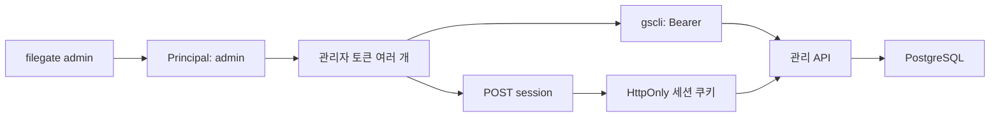

# spec 05: 독립형 관리자 인증

- 상태: 작업 브랜치 구현, 미릴리스·미배포
- 범위: 단일 관리자, 복수 토큰, 콘솔 세션, 로컬 복구
- 콘솔 로그인·로그아웃·개요 조회는 실제 API 연결 및 로컬 HTTPS 검증 완료다. 변경 화면·운영 배포는 후속이다.

## 자격증명 경계

| 종류 | 주체 → 대상 | 저장 | 권한 |
|---|---|---|---|
| 관리자 토큰 `fgop_` | 관리자·gscli → 관리 API | 도메인 분리 SHA-256 해시 | 등록부 조회·변경 |
| 콘솔 세션 `fgss_` | 브라우저 → 관리 API | 도메인 분리 SHA-256 해시 | 발급한 관리자 토큰과 동일 |
| Native client key | 서비스 → `/api/v1` | 기존 SHA-256 해시 | 해당 client 파일 |
| Client S3 credential | 서비스 → S3 호환 API | access ID + 암호화 secret | 해당 client 버킷 |
| Provider credential | FileGate → 외부 S3 | 암호화 secret | 외부 provider 정책 |

외부 인증 서비스 없이 FileGate·PostgreSQL로 운영한다. 한 Principal의 토큰을
구분해 감사하며, 여러 사람의 신원 구분은 후속 범위다.

## 초기화와 복구

서버와 동일한 `FILEGATE_DATABASE_URL`·`FILEGATE_ENC_ROOT_SECRET` 환경에서 실행한다.
이 명령은 서버 바이너리의 로컬 명령이며 `gscli` 원격 명령과 구분한다.

| 명령 | 결과 |
|---|---|
| `filegate admin init` | 최초 Principal·토큰 생성, 재실행 거부 |
| `filegate admin token create gscli` | 관리자 토큰 추가 |
| `filegate admin token list` | ID·이름·만료·폐기 시각 |
| `filegate admin token revoke UUID --yes` | 토큰·연결 세션 폐기 |
| `filegate admin recover --yes` | 모든 기존 토큰·세션 폐기 후 대체 토큰 발급 |

| 조건 | 계약 |
|---|---|
| 발급 | CSPRNG 32바이트, 접두사 + 64hex |
| 토큰 만료 | 발급 후 90일 |
| 평문 출력 | 발급 명령 stdout JSON에 한 번 출력; 안전한 보관 경로로 전달 |
| DB 저장 | 평문 대신 해시; 목록에서 해시도 제외 |
| 동시 초기화·복구·폐기·로그인 | PostgreSQL transaction advisory lock으로 직렬화 |
| 마지막 토큰 폐기·분실 | 서버 로컬 `recover --yes`로 복구 |
| 로컬 명령 권한 | 운영 DB 접근 권한을 가진 설치 관리자 |

## 브라우저 세션

`FILEGATE_CONSOLE_ORIGIN=https://storage.example.com`처럼 경로·후행 `/` 없는
HTTPS origin을 설정한다. 미설정이면 브라우저 로그인을 비활성화한다.
실제 콘솔과 API는 같은 origin으로 제공하고 TLS는 서버 앞단에서 종료한다.

| 요청 | 입력 | 결과 |
|---|---|---|
| `POST /api/admin/v1/session` | JSON `{ "token": "..." }` | Principal·credential ID·만료, Set-Cookie |
| `GET /api/admin/v1/session` | 세션 쿠키 | Principal·credential ID |
| `DELETE /api/admin/v1/session` | 세션 쿠키 | 서버 세션 삭제, 쿠키 만료, 204 |
| 기존 관리 API | 관리자 Bearer 또는 세션 쿠키 | 기존 리소스 계약 |

| 보안 조건 | 구현 |
|---|---|
| 쿠키 | `__Host-filegate_session`; Secure·HttpOnly·SameSite=Strict·Path=/ |
| 세션 만료 | 최대 8시간, 원본 토큰 만료 이내; 자동 연장 없음 |
| 세션 수 | 토큰당 64개; 초과 로그인 시 가장 오래된 세션 제거 |
| 세션 정리 | 로그인 때 만료 세션 제거; 폐기·복구 때 관련 세션 제거 |
| CSRF | 로그인·로그아웃·쿠키 인증 변경 요청에 정확한 Origin + `X-FileGate-CSRF: 1` |
| 교차 origin | 관리 API CORS는 비활성; 쿠키 인증의 다른 Origin·cross-site 요청 거부 |
| 인증 선택 | Authorization이 있으면 Bearer만 검사; 잘못된 Bearer의 쿠키 fallback 없음 |
| 폐기 확인 | 매 요청에서 토큰·세션의 만료·폐기를 DB 조회 |
| 진행 중 요청 | 이미 인증을 통과한 요청은 완료될 수 있음 |
| 로그인 제한 | DB 전체 공유 고정 창, 분당 60회; 초과 시 429·Retry-After |
| 브라우저 보관 | 실제 UI 연결 시 토큰을 로그인 후 비우고 쿠키만 사용 |
| 캐시 | 성공한 관리·세션 응답 `Cache-Control: no-store` |

로그인 제한은 단일 관리자용 전역 예산이다. 공개 노출 시 앞단의 접근 제어·rate limit을
함께 적용한다. 관리자 토큰과 세션은 같은 관리자 권한의 bearer secret이다.

## 전환과 감사

| 단계 | 동작 |
|---|---|
| 새 버전 배포 | 기존 `FILEGATE_OPERATOR_TOKENS` 계속 사용, 기존 파일 API 유지 |
| 모든 replica 업데이트 확인 | 구버전 서버를 종료하고 운영 접근·복구 경로 확인 |
| `filegate admin init` | DB 인증 활성화, 환경변수 토큰 즉시 비활성 |
| CLI 교체 | 새 토큰을 기존 `GROVE_OPERATOR_TOKEN` 또는 `--token-file`로 전달 |
| 정리 | 환경변수 운영자 토큰 제거; 마스터 키는 유지 |

초기화 전 환경변수 토큰은 관리 API Bearer 호환만 제공한다. 브라우저 로그인에는
DB 토큰을 사용한다. 초기화 이후 구버전으로 롤백하면 환경변수 인증이 다시 살아날 수
있으므로 구버전 롤백은 인증 정책을 포함한 별도 운영 절차로 다룬다.

`admin_audit_events`는 초기화·발급·폐기·복구·로그인 성공과 관리 변경 요청을 기록한다.
관리 변경은 실행 전 intent를 저장하고 실행 후 HTTP status를 기록한다.

| 필드 | 의미 |
|---|---|
| actor | admin / legacy / local |
| credential_id | 사용한 DB 관리자 토큰 ID, legacy·local은 NULL |
| action·target | 메서드·리소스 경로 또는 로컬 명령·토큰 ID; query·본문·평문 secret 제외 |
| status | HTTP 결과; NULL은 중단·timeout·완료 기록 실패로 결과 확인 필요 |

감사 intent 저장 실패는 변경 전에 거부한다. 완료 기록 실패는 이미 실행한 응답을
유지하고 오류 로그를 남긴다. 인증 실패·로그아웃의 별도 감사, 감사 조회 UI·보존 정책,
원격 관리자 토큰 관리·콘솔 변경 화면은 후속 작업이다.
